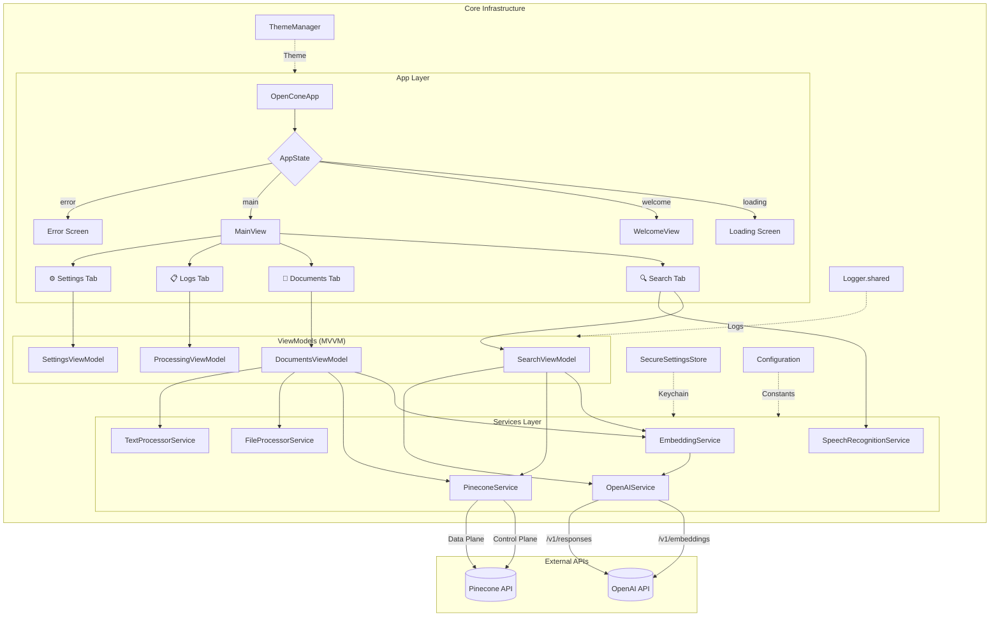
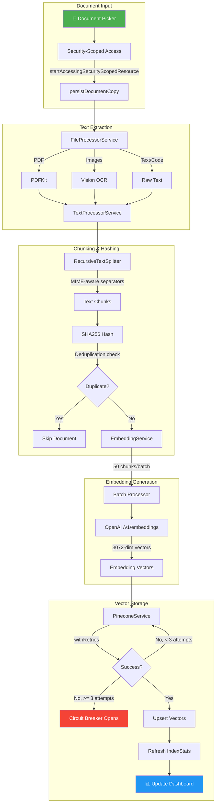
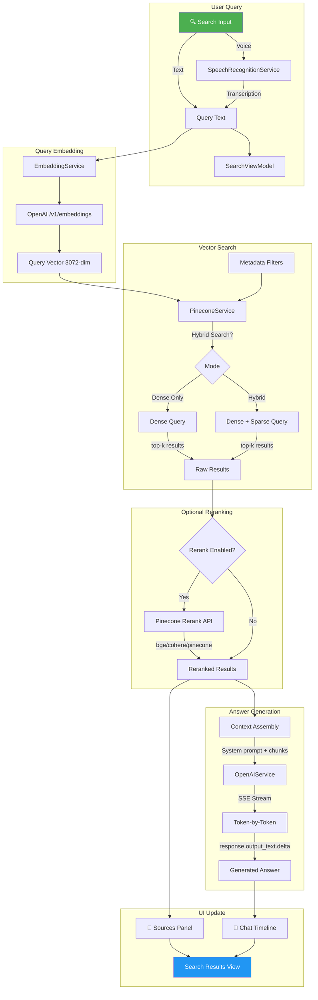
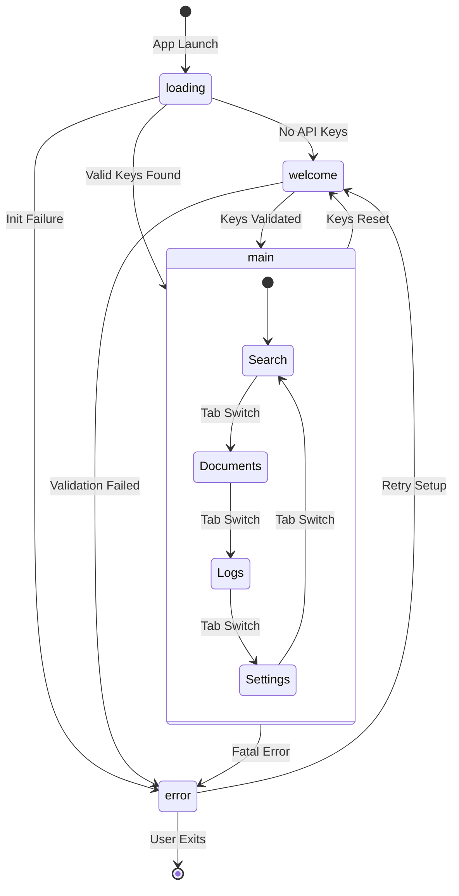
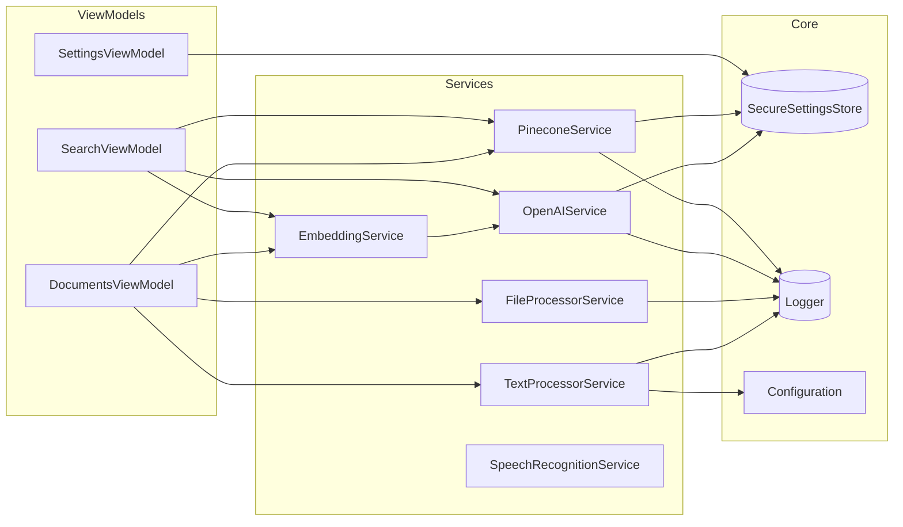

# OpenCone Architecture

## High-Level Goal

OpenCone is a privacy-first, on-device RAG (Retrieval Augmented Generation) application for iOS and macOS Catalyst. Users ingest personal documents (PDF, DOCX, images, code files), which are processed locally with text extraction and OCR, chunked semantically, embedded via OpenAI, and stored in Pinecone. Queries embed the user's question, retrieve relevant chunks from Pinecone, and stream grounded answers from OpenAI's Responses API.

## System Overview



## Data Flow

### Ingestion Pipeline



### Search Pipeline



### App State Machine



### Service Dependencies



## Tech Stack

| Layer           | Technology                                   |
| --------------- | -------------------------------------------- |
| UI Framework    | SwiftUI (iOS 17+, macOS 14 Catalyst)         |
| Concurrency     | Swift async/await, Combine                   |
| Text Extraction | PDFKit, Vision (OCR)                         |
| NLP             | NaturalLanguage framework (tokenization)     |
| Hashing         | CryptoKit (SHA256)                           |
| Networking      | URLSession with custom retry/circuit breaker |
| Vector Storage  | Pinecone (serverless)                        |
| Embeddings      | OpenAI text-embedding-3-large (3072 dim)     |
| Completions     | OpenAI Responses API (gpt-4o, o3-mini, etc.) |
| Secrets         | iOS Keychain via SecureSettingsStore         |
| Theming         | Custom design system (OCTheme, ThemeManager) |
| Speech/Audio    | SFSpeechRecognizer & AVAudioEngine (Voice input) |

## Key Components

### App Layer (`/App`)

| File                | Purpose                                                                                                                                                  |
| ------------------- | -------------------------------------------------------------------------------------------------------------------------------------------------------- |
| `OpenConeApp.swift` | Entry point. Manages `AppState` enum (loading→welcome→main→error). Wires services and view models. Enforces no-bundled-secrets guard for release builds. |
| `MainView.swift`    | Tab container (Search, Documents, Logs, Settings). Coordinates index refresh on tab switches.                                                            |
| `WelcomeView.swift` | First-run onboarding flow for API key entry with live validation.                                                                                        |

### Features Layer (`/Features`)

| Domain            | Key Files                                           | Responsibilities                                                                                     |
| ----------------- | --------------------------------------------------- | ---------------------------------------------------------------------------------------------------- |
| **Documents**     | `DocumentsViewModel.swift`, `DocumentsView.swift`   | Document add/remove, processing orchestration, progress tracking, dashboard metrics                  |
| **Search**        | `SearchViewModel.swift`, `SearchView.swift`         | Query embedding, Pinecone search, streaming answer generation, metadata filters, conversation memory |
| **Settings**      | `SettingsViewModel.swift`, `SettingsView.swift`     | API key management, model selection, chunk config, search presets, theme control                     |
| **ProcessingLog** | `ProcessingViewModel.swift`, `ProcessingView.swift` | Real-time log display, log export, level filtering                                                   |

### Services Layer (`/Services`)

| Service                | Key Patterns                                                                                                                                                                  |
| ---------------------- | ----------------------------------------------------------------------------------------------------------------------------------------------------------------------------- |
| `PineconeService`      | `withRetries(maxRetries:)` for transient failures; circuit breaker (`isCircuitOpen`, `healthFailureThreshold`); host caching with TTL; rate limiting (100ms between requests) |
| `OpenAIService`        | Responses API with `input` array format; SSE parsing for streaming; reasoning effort for o-series models; dimension passthrough for embeddings                                |
| `EmbeddingService`     | Batch processing (50 chunks); dimension validation; progress callbacks                                                                                                        |
| `FileProcessorService` | MIME detection; PDFKit page iteration; Vision `VNRecognizeTextRequest` for OCR                                                                                                |
| `TextProcessorService` | RecursiveTextSplitter with MIME-specific separators; content hashing; token metrics                                                                                           |
| `SpeechRecognitionService` | `SFSpeechRecognizer` integration; asynchronous authorization request; `AVAudioEngine` input tap with real-time level calculation (0.0-1.0 normalization) for UI waveform animation |

### Core Layer (`/Core`)

| Module                       | Purpose                                                                                                                |
| ---------------------------- | ---------------------------------------------------------------------------------------------------------------------- |
| `Logger`                     | Singleton (`Logger.shared`) with `@Published logEntries` for UI binding. Levels: debug, info, success, warning, error. |
| `SecureSettingsStore`        | Keychain wrapper for secrets (OpenAI API key, Pinecone API key, Project ID) and custom Pinecone API plane versions. Non-secrets reside in UserDefaults. |
| `Configuration`              | Static constants (embedding model, dimension, chunk size). Environment variable seeding for dev.                       |
| `PineconePreferenceResolver` | Persists last-used index/namespace selections.                                                                         |
| `DesignSystem`               | `OCButton`, `OCCard`, `OCBadge`, `OCTheme`, `ThemeManager`. Use `@Environment(\.theme)` in views.                      |

## Design Patterns

| Pattern                       | Implementation                                                                                |
| ----------------------------- | --------------------------------------------------------------------------------------------- |
| **MVVM**                      | Views observe `@ObservedObject` ViewModels; ViewModels call Services                          |
| **Dependency Injection**      | Services created in `OpenConeApp`, passed to ViewModels in `createViewModels()`               |
| **Singleton**                 | `Logger.shared`, `SecureSettingsStore.shared`, `ThemeManager.shared`                          |
| **Circuit Breaker**           | `PineconeService.isCircuitOpen` opens after N consecutive failures, auto-resets after timeout |
| **Retry with Backoff**        | `withRetries(maxRetries:)` wrapper in `PineconeService`                                       |
| **Progress Callbacks**        | Async closures passed to `EmbeddingService.generateEmbeddings(progressCallback:)`             |
| **Security-Scoped Bookmarks** | Required for file access across app launches; `needsSecurityConsent` banner pattern           |

## API Integration Details

### OpenAI Responses API (`/v1/responses`)

**Endpoint**: `https://api.openai.com/v1/responses`

#### Currently Implemented

| Parameter           | Implementation                                        | Location                                 |
| ------------------- | ----------------------------------------------------- | ---------------------------------------- |
| `model`             | Dynamic via `UserDefaults` (default: `gpt-4o`)        | `OpenAIService.currentCompletionModel()` |
| `input`             | Array format with system/user/assistant roles         | `OpenAIService.buildResponsesInput()`    |
| `stream`            | SSE parsing with multiple event types                 | `OpenAIService.streamCompletion()`       |
| `max_output_tokens` | Configurable via Settings                             | `OpenAIService.currentMaxOutputTokens()` |
| `temperature`       | 0.0-2.0, stored in UserDefaults                       | `OpenAIService.currentTemperature()`     |
| `top_p`             | 0.0-1.0, stored in UserDefaults                       | `OpenAIService.currentTopP()`            |
| `reasoning.effort`  | `none`/`low`/`medium`/`high`/`max` for gpt-5/o-series | `OpenAIService.currentReasoningEffort()` |
| `tools`             | `web_search`, `code_interpreter`                      | `OpenAIService.streamCompletion()`       |
| `include`           | Web search sources (`web_search_call.action.sources`), code interpreter outputs (`code_interpreter_call.outputs`) | `OpenAIService.streamCompletion()` |
| `conversation`      | Server-managed conversation ID                        | `conversationId` passthrough             |
| `store`             | Always `false` (privacy-first)                        | Hardcoded |

#### SSE Events Handled

| Event                         | Purpose                                      |
| ----------------------------- | -------------------------------------------- |
| `response.output_text.delta`  | Primary text streaming                       |
| `response.content_part.delta` | Alternative format with tools                |
| `response.text.delta`         | Variant format                               |
| `response.output_item.delta`  | Item-level deltas                            |
| `response.output_item.done`   | Final content extraction                     |
| `response.completed`          | Stream termination + conversation ID capture |
| `response.created`            | Initial response acknowledgment              |

#### Not Yet Implemented

- `text.format` (Structured Outputs with JSON schema)
- `include` array parameters like `message.output_text.logprobs` (confidence scoring)
- `background` (async processing)
- `prompt_cache_key` / `prompt_cache_retention`
- `truncation` strategy
- `tools[].type: "function"` (custom function calling)
- `tools[].type: "file_search"` (OpenAI-hosted search)
- `tools[].type: "mcp"` (external connectors)

### OpenAI Embeddings API (`/v1/embeddings`)

| Parameter    | Value                              |
| ------------ | ---------------------------------- |
| `model`      | `text-embedding-3-large` (default) |
| `dimensions` | 3072 (must match Pinecone index)   |
| `input`      | Batched (50 texts per request)     |

### Pinecone API

**API Versions** (configurable via `SecureSettingsStore`):

| Plane                    | Version   | Header                   |
| ------------------------ | --------- | ------------------------ |
| Control Plane            | `2024-07` | `X-Pinecone-API-Version` |
| Data Plane               | `2024-07` | `X-Pinecone-API-Version` |
| Namespace (preview)      | `2025-10` | `X-Pinecone-API-Version` |
| Metadata Fetch (preview) | `2025-10` | `X-Pinecone-API-Version` |

#### Endpoints Implemented

| Category      | Endpoint                              | Method | Purpose                      |
| ------------- | ------------------------------------- | ------ | ---------------------------- |
| **Index**     | `/indexes`                            | GET    | List all indexes             |
| **Index**     | `/indexes`                            | POST   | Create serverless index      |
| **Index**     | `/indexes/{name}`                     | GET    | Describe index (get host)    |
| **Index**     | `/indexes/{name}`                     | DELETE | Delete index                 |
| **Vectors**   | `https://{host}/vectors/upsert`       | POST   | Upsert vectors with metadata |
| **Vectors**   | `https://{host}/query`                | POST   | Semantic/hybrid query        |
| **Vectors**   | `https://{host}/vectors/delete`       | POST   | Delete by ID or filter       |
| **Vectors**   | `https://{host}/vectors/update`       | POST   | Update vector/metadata       |
| **Vectors**   | `https://{host}/vectors/fetch`        | GET    | Fetch by IDs                 |
| **Namespace** | `https://{host}/describe_index_stats` | POST   | Get namespace stats          |
| **Inference** | `/rerank`                             | POST   | Rerank documents             |
| **Inference** | `/embed`                              | POST   | Generate sparse embeddings   |

#### Hybrid Search Implementation

```
weightedDense = denseVector × alpha
weightedSparse = sparseVector × (1 - alpha)

alpha = 1.0 → Pure semantic
alpha = 0.5 → Balanced
alpha = 0.0 → Pure keyword
```

#### Reranking Models

| Model              | ID                   |
| ------------------ | -------------------- |
| BGE Reranker v2 M3 | `bge-reranker-v2-m3` |
| Cohere Rerank 3.5  | `cohere-rerank-3.5`  |
| Pinecone Rerank v0 | `pinecone-rerank-v0` |

#### Resilience Patterns

| Pattern         | Config                              | Purpose                    |
| --------------- | ----------------------------------- | -------------------------- |
| Rate Limiting   | 100ms between requests              | Prevent 429s               |
| Retry           | 3 attempts, exponential backoff     | Transient failure recovery |
| Circuit Breaker | Opens after N failures, auto-resets | Prevent cascade failures   |
| Host Caching    | TTL-based                           | Reduce describe calls      |
| Stats Caching   | TTL-based                           | Reduce stats polling       |
