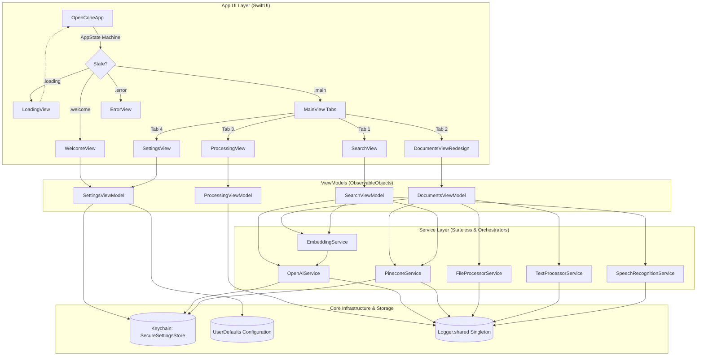

# OpenCone System Architecture

This document provides a detailed technical breakdown of the OpenCone codebase, design patterns, API planes, and data boundaries.

---

## 1. Architectural Thesis

OpenCone is engineered as a **local-first front end and cloud-hybrid RAG (Retrieval-Augmented Generation) client** for Apple platforms. Rather than relying on custom middleware or a proprietary web dashboard, OpenCone performs document preparation on device and then talks directly to OpenAI and Pinecone for embeddings, vector retrieval, and answer generation.

The architecture is built upon the **MVVM-S (Model-View-ViewModel-Service)** design pattern. It enforces strict separation of concerns:
- **Views** are declarative SwiftUI structures that only render published state and bind user interactions.
- **ViewModels** manage interface-specific workflows, coordinate task concurrency, and dispatch actions to the service layer.
- **Services** are stateless utility managers or stateful singletons (e.g. Keychain access, Speech, network client layers) that wrap third-party API payloads, run local processing algorithms (OCR, tokenization), and handle network failures.

By leveraging Swift's modern concurrency (`async/await`, Task structures) and reactive publishing (Combine frameworks), OpenCone delivers a high-performance native client for a cloud-backed RAG pipeline while respecting sandboxed security boundaries.

---

## 2. High-Level Architecture Overview



---

## 3. Layer-by-Layer Breakdown

### App Shell & Lifecycle
- **[OpenConeApp.swift](OpenCone/App/OpenConeApp.swift)**: Bootstrap layer. Operates as a state machine governing the transition from initial boot, welcome onboarding (API key registration), active main application UI, and unrecoverable errors. 
- **Release Safety Enforcer**: Inside `enforceNoBundledSecrets()`, the app calls a fatal assertion in non-debug targets if hardcoded OpenAI/Pinecone environment credentials are detected.

### Views (SwiftUI Presentation)
- **[MainView.swift](OpenCone/App/MainView.swift)**: Hosts the primary tab switcher. Hooks into the scene lifecycle to trigger refresh updates (index stats, document states) on tab selections.
- **[DocumentsViewRedesign.swift](OpenCone/Features/Documents/DocumentsViewRedesign.swift)**: Card-based dashboard reporting file status metrics, ingestion success/failure bars, and floating context action popups.
- **[SearchView.swift](OpenCone/Features/Search/SearchView.swift)**: Main interaction canvas for semantic lookup, displaying streaming tokens, query suggestions, interactive citation details, and audio waveforms.

### ViewModels (State Orchestration)
- All view models inherit from `ObservableObject` and utilize `@Published` properties.
- **[DocumentsViewModel.swift](OpenCone/Features/Documents/DocumentsViewModel.swift)**: Maintains the queue of local files undergoing extraction, chunking, and upload. Exposes metrics like total namespace counts.
- **[SearchViewModel.swift](OpenCone/Features/Search/SearchViewModel.swift)**: Converts user prompt texts or voice transcription tokens into queries, executes searches, and streams response tokens.

### Services Layer
- **[PineconeService.swift](OpenCone/Services/PineconeService.swift)**: Implements REST operations for index control (list, create, delete) and vector data actions (upsert, query, delete). Features stateful region/host discovery and circuit-breaking error protection.
- **[OpenAIService.swift](OpenCone/Services/OpenAIService.swift)**: Connects to the Embeddings (`/v1/embeddings`) and Responses (`/v1/responses`) endpoints. Implements Server-Sent Events (SSE) stream decoding.
- **[FileProcessorService.swift](OpenCone/Services/FileProcessorService.swift)**: Identifies file MIME types, resolves sandboxed security-scoped URLs, reads plaintext/docx data, and uses native `VNRecognizeTextRequest` OCR on image uploads.
- **[TextProcessorService.swift](OpenCone/Services/TextProcessorService.swift)**: Segments raw text strings recursively using boundary separators (such as JSON tags, markdown hashes, or newlines) and computes SHA256 hashes.
- **[SpeechRecognitionService.swift](OpenCone/Services/SpeechRecognitionService.swift)**: Listens to the device microphone, performs speech-to-text conversion via Apple's Speech API, and publishes normalize audio amplitudes (0.0 - 1.0) for UI waveforms.

---

## 4. State Management Model

OpenCone relies on a top-down state model:
1. **App State Machine**: Transition flow managed in [OpenConeApp.swift](OpenCone/App/OpenConeApp.swift):
   ```
   [Boot] ──► .loading ──► (Verify Keys?) ──┬──► [Keys Missing] ──► .welcome
                                            └──► [Keys Valid]   ──► .main
   ```
2. **Ingestion Queue State**: Each document is represented by a `DocumentModel` containing a `ProcessingStatus` enum (`.pending`, `.extracting`, `.chunking`, `.embedding`, `.uploading`, `.completed`, `.failed(String)`). The UI listens to changes in `documentProgress` to update progress indicators dynamically.
3. **Session Chat State**: `SearchViewModel` holds a published array of message objects. Changes (such as appending streaming deltas or adding sources) trigger immediate, efficient view hierarchy updates.

---

## 5. Concurrency Model

OpenCone utilizes Swift's structured concurrency (`async/await`) to maintain responsive UI behaviors:
- **Main Actor Thread safety**: ViewModels are decorated with `@MainActor`. All property updates that mutate UI elements are guaranteed to execute on the main thread, eliminating thread-safety assertions.
- **Task Boundaries**: Background workloads (such as text extraction and Pinecone vector uploads) are dispatched to detached tasks, freeing the main thread to handle user scrolls and animations.
- **Task Cancellation**: Active streaming requests (`currentStreamTask`) are canceled when a user navigates away from the Search tab or requests a query stop, preventing memory leaks and resource drain.
- **Autoreleasepool**: Local Vision OCR processes large image files in isolated pools to flush heavy native buffers immediately.

---

## 6. Error Handling & Resilience

OpenCone integrates multi-layered network recovery patterns to cope with API failures:
1. **Exponential Backoff**: Transient errors (e.g. 503 Service Unavailable or network dropouts) trigger up to 3 retry attempts with an increasing sleep duration.
2. **Circuit Breaker**: Guarded by a circuit breaker state in `PineconeService`. If consecutive API requests fail beyond the threshold, the circuit trips to `.open`. Subsequent requests fail immediately to prevent request flooding, auto-resetting after a timeout or when the user changes indexes.
3. **Stream Watchdog**: A dedicated timeout watchdog task monitors the OpenAI SSE tokens stream. If no tokens are received within `Constants.watchdogDelayNanoseconds` (30 seconds), the task terminates the connection and returns a user-friendly error string.

---

## 7. API Integration Map

### OpenAI Responses API (`/v1/responses`)
- **Protocol**: Server-Sent Events (SSE) stream over HTTPS.
- **Parameters**: 
  - `model`: Defaults to `gpt-4o` (or custom parameters).
  - `stream`: Set to `true`.
  - `input`: Formatted as structured message JSON objects.
  - `tools`: Conditionally activates `web_search` or `code_interpreter` based on text context heuristics.
  - `reasoning.effort`: Configured dynamically for reasoning-capable models (e.g., `o3-mini`, `gpt-5`).
- **Events Handled**:
  - `response.output_text.delta` / `response.text.delta`: Text streaming segments.
  - `response.completed`: Captures the server conversation ID and finalizes token metrics.

### OpenAI Embeddings API (`/v1/embeddings`)
- **Model**: `text-embedding-3-large`.
- **Dimensions**: Default output is `3072` float vectors.
- **Batching**: Embedded in batches of 50 text chunks.

### Pinecone REST API
OpenCone connects to serverless Pinecone indexes using designated versions configurable in the Secure Store:
- **Control Plane (`/indexes`)**: Used to list, retrieve configuration hosts, or provision serverless indexes. (Header: `X-Pinecone-API-Version: 2024-07`).
- **Data Plane (`/vectors/upsert`, `/query`, `/vectors/delete`)**: Vector reads, similarity scoring, and namespace removals. (Header: `X-Pinecone-API-Version: 2024-07`).
- **Namespace Plane (`/describe_index_stats`)**: Gathers counts per namespace to refresh local dashboards. (Header: `X-Pinecone-API-Version: 2025-10`).

---

## 8. Architectural Tradeoffs

- **On-Device vs Cloud Orchestration**: File preparation happens locally, but embeddings, vector persistence, vector search, and answer synthesis still depend on OpenAI and Pinecone. This keeps the client native and direct, but it is not a fully offline architecture.
- **Unencrypted Sandbox Cache**: The application copies files to local sandbox storage to generate persistent bookmarks. While sandboxed from other iOS apps, it requires device-level passcode enforcement for data safety.
- **Stateless Services**: Services do not retain state (except configurations). This requires ViewModels to keep track of query history and document status tables, increasing ViewModel state complexity.

---

## 9. Future Extension Points

- **Local Vector Database (Offline RAG)**: Integrate local vector stores (e.g. SQLite vector extensions or native libraries) to enable offline semantic queries when internet access is unavailable.
- **Multimodal Ingestion**: Feed images directly into OpenAI completions without pre-processing them via local Vision OCR.
- **Parallel File Processing**: Extend `DocumentsViewModel` to spin up parallel worker Tasks, speeding up multi-document imports.
