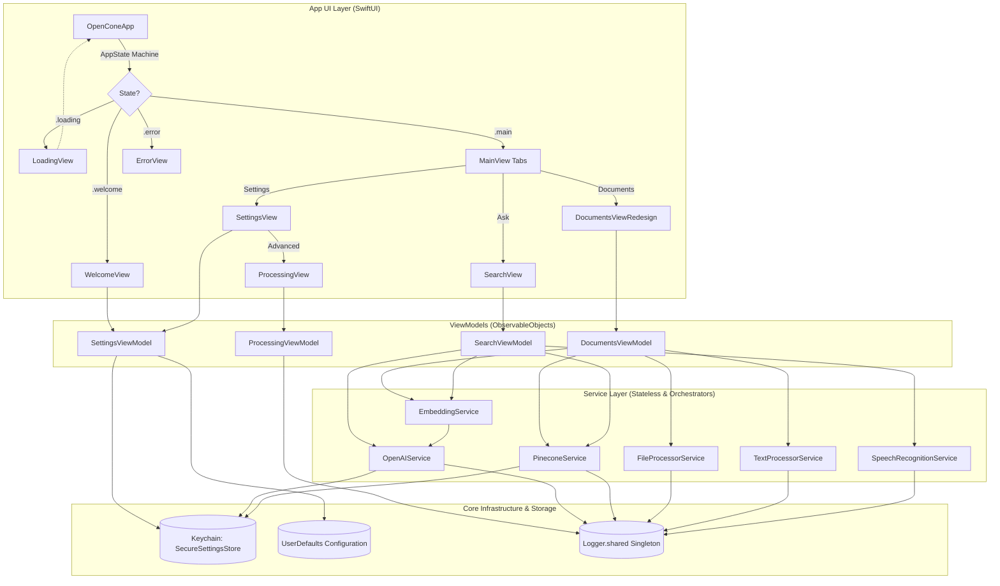

# OpenCone System Architecture

This document provides a detailed technical breakdown of the OpenCone codebase, design patterns, API planes, and data boundaries.

---

## 1. Architectural Thesis

OpenCone is engineered as a **cloud-hybrid RAG (Retrieval-Augmented Generation) client** for iPhone. Rather than relying on custom middleware or a proprietary web dashboard, OpenCone performs document preparation on device and then talks directly to OpenAI and Pinecone for embeddings, vector retrieval, and answer generation.

The architecture is built upon the **MVVM-S (Model-View-ViewModel-Service)** design pattern. It enforces strict separation of concerns:
- **Views** are declarative SwiftUI structures that only render published state and bind user interactions.
- **ViewModels** manage interface-specific workflows, coordinate task concurrency, and dispatch actions to the service layer.
- **Services** are stateless utility managers or stateful singletons (e.g. Keychain access, Speech, network client layers) that wrap third-party API payloads, run local processing algorithms (PDF text extraction, tokenization), and handle network failures.

By leveraging Swift's modern concurrency (`async/await`, Task structures) and reactive publishing (Combine frameworks), OpenCone delivers a high-performance native client for a cloud-backed RAG pipeline while respecting sandboxed security boundaries.

---

## 2. High-Level Architecture Overview


```mermaid
flowchart TD
    subgraph UI["App UI Layer (SwiftUI)"]
        APP[OpenConeApp] -->|AppState Machine| AS{State?}
        AS -->|.loading| LV[LoadingView]
        AS -->|.welcome| WV[WelcomeView]
        AS -->|.main| MV[MainView Tabs]
        AS -->|.error| EV[ErrorView]

        MV -->|Ask| SV[SearchView]
        MV -->|Documents| DV[DocumentsViewRedesign]
        MV -->|Settings| SetV[SettingsView]
        SetV -->|Advanced| PV[ProcessingView]
    end

    subgraph MVVM["ViewModels (ObservableObjects)"]
        SVM[SearchViewModel]
        DVM[DocumentsViewModel]
        PVM[ProcessingViewModel]
        SetVM[SettingsViewModel]
    end

    subgraph ServiceLayer["Service Layer (Stateless & Orchestrators)"]
        FPS[FileProcessorService]
        TPS[TextProcessorService]
        EMS[EmbeddingService]
        OAS[OpenAIService]
        PCS[PineconeService]
        SRS[SpeechRecognitionService]
    end

    subgraph Infrastructure["Core Infrastructure & Storage"]
        SEC[(Keychain: SecureSettingsStore)]
        UD[(UserDefaults Configuration)]
        LOG[(Logger.shared Singleton)]
    end

    %% Wiring
    LV -.-> APP
    WV --> SetVM
    DV --> DVM
    SV --> SVM
    PV --> PVM
    SetV --> SetVM

    DVM --> FPS & TPS & EMS & PCS
    SVM --> EMS & PCS & OAS & SRS
    SetVM --> SEC & UD
    PVM --> LOG

    EMS --> OAS
    OAS --> SEC & LOG
    PCS --> SEC & LOG
    FPS --> LOG
    TPS --> LOG
    SRS --> LOG
```

---

## 3. Layer-by-Layer Breakdown

### App Shell & Lifecycle
- **[OpenConeApp.swift](OpenCone/App/OpenConeApp.swift)**: Bootstrap layer. Operates as a state machine governing the transition from initial boot, welcome onboarding (API key registration), active main application UI, and unrecoverable errors. 
- **Release Safety Enforcer**: Inside `enforceNoBundledSecrets()`, the app calls a fatal assertion in non-debug targets if OpenAI/Pinecone keys are set as environment variables.

### Views (SwiftUI Presentation)
- **[MainView.swift](OpenCone/App/MainView.swift)**: Three tabs (Ask, Documents, Settings), each in a `NavigationStack`. Reloads the index list when Ask is opened. Errors from Documents and Settings show as an alert; Ask shows its own in place.
- **[DocumentsViewRedesign.swift](OpenCone/Features/Documents/DocumentsViewRedesign.swift)**: Card-based dashboard reporting file status metrics, ingestion success/failure bars, and floating context action popups.
- **[SearchView.swift](OpenCone/Features/Search/SearchView.swift)**: The Ask screen, laid out like OpenResponses' chat: `ChatStatusBar` (model menu, reasoning effort, tool badges, the gear for `AnswerSettingsPanel`), `SearchScopeBar` (where to search, opening `SearchScopeSheet`), the conversation in `MessageBubble`s, and `ChatComposer`. Answers render through `MarkdownText`, which parses blocks itself (headings, lists, tables, quotes, code) and turns passage tags such as [S2] into `opencone-source://` links; a tag or a source chip opens `SourcesPresentationView`.
- **[SettingsView.swift](OpenCone/Features/Settings/SettingsView.swift)**: Segmented tabs over grouped forms, as in OpenResponses: General (keys, your data, about), Answers (the same `AnswerSettingsForm` as the gear in Ask), Advanced (search defaults, uploads, log level and the activity log, Pinecone API versions).
- **Appearance**: One theme built from system colors (`OCTheme.system`); the app follows the system's light or dark setting and Dynamic Type.
- **[DemoMode.swift](OpenCone/App/DemoMode.swift)**: Debug builds only. The `-OpenConeDemo` launch argument opens the app on sample indexes and a sample conversation with no keys and no requests, for screenshots; `-OpenConeDemoScreen <name>` also opens one sheet or tab.

### ViewModels (State Orchestration)
- All view models inherit from `ObservableObject` and utilize `@Published` properties.
- **[DocumentsViewModel.swift](OpenCone/Features/Documents/DocumentsViewModel.swift)**: Maintains the queue of local files undergoing extraction, chunking, and upload. Exposes metrics like total namespace counts.
- **[SearchViewModel.swift](OpenCone/Features/Search/SearchViewModel.swift)**: Runs a question at the width chosen under Where to search (`SearchScope`): `routeAndAnswer` (Auto), `searchEverything` (every namespace of every included index, merged by rank, then by how far each passage stands above the rest of its own search, with a euclidean index's lowest distance read as its best), or `searchOpenIndex` (the open index, in one namespace or each of them through `searchNamespaces`). Each answer's message keeps the passages it was written from (`ChatMessage.sources`).

### Services Layer
- **[PineconeService.swift](OpenCone/Services/PineconeService.swift)**: Implements REST operations for index control (list, create, delete) and vector data actions (upsert, query, delete). Features stateful region/host discovery and circuit-breaking error protection.
- **[OpenAIService.swift](OpenCone/Services/OpenAIService.swift)**: Connects to the Embeddings (`/v1/embeddings`) and Responses (`/v1/responses`) endpoints. Implements Server-Sent Events (SSE) stream decoding.
- **[ResponsesClient.swift](OpenCone/Services/ResponsesClient.swift)**: Non-streamed Responses calls whose output is a decision rather than prose: the routing call, which returns `function_call` items, and drafting an index's one-line summary.
- **[Routing](OpenCone/Features/Search/Routing/)**: `IndexRouter` builds the `search_index` tool and checks the model's calls; `IndexSurveyor` reads each index's namespaces, finds which OpenAI model built it, and drafts its summary; `IndexProfile` and `IndexCatalogStore` keep that per Pinecone project on the phone, with the indexes the person left out; `IndexDetailView` (in `SearchScopeViews.swift`) lets the person rewrite a summary or leave an index out.
- **[FileProcessorService.swift](OpenCone/Services/FileProcessorService.swift)**: Identifies file MIME types, extracts PDF text with `PDFKit`, and reads text formats as UTF-8. Its `VNRecognizeTextRequest` OCR path for images never runs, because the document picker does not offer images.
- **[TextProcessorService.swift](OpenCone/Services/TextProcessorService.swift)**: Segments raw text strings recursively, splitting every type on paragraphs, lines, sentences, then words, and computes SHA256 hashes.
- **[SpeechRecognitionService.swift](OpenCone/Services/SpeechRecognitionService.swift)**: Listens to the device microphone, performs speech-to-text conversion via Apple's Speech API, and publishes normalize audio amplitudes (0.0 - 1.0) for UI waveforms.

---

## 4. State Management Model

OpenCone relies on a top-down state model:
1. **App State Machine**: Transition flow managed in [OpenConeApp.swift](OpenCone/App/OpenConeApp.swift):
   ```
   [Boot] ──► .loading ──► (Verify Keys?) ──┬──► [Keys Missing] ──► .welcome
                                            └──► [Keys Valid]   ──► .main
   ```
2. **Ingestion Queue State**: Each document is represented by a `DocumentModel` containing a `ProcessingStatus` enum (`.pending`, `.extracting`, `.chunking`, `.embedding`, `.uploading`, `.completed`, `.failed(String)`). The UI listens to changes in `documentProgress` to update progress indicators dynamically.
3. **Session Chat State**: `SearchViewModel` holds a published array of message objects. Changes (such as appending streaming deltas or adding sources) trigger immediate, efficient view hierarchy updates.

---

## 5. Concurrency Model

OpenCone utilizes Swift's structured concurrency (`async/await`) to maintain responsive UI behaviors:
- **Main Actor Thread safety**: ViewModels are decorated with `@MainActor`. All property updates that mutate UI elements are guaranteed to execute on the main thread, eliminating thread-safety assertions.
- **Task Boundaries**: Background workloads (such as text extraction and Pinecone vector uploads) are dispatched to detached tasks, freeing the main thread to handle user scrolls and animations.
- **Task Cancellation**: Every search runs in one task (`routingTask`) and the answer in another (`currentStreamTask`); Stop cancels both, so it works during the searches as well as while the answer streams, and leaves an answer that can be asked again.
- **Autoreleasepool**: Chunking and embedding loops run inside `autoreleasepool`.

---

## 6. Error Handling & Resilience

OpenCone integrates multi-layered network recovery patterns to cope with API failures:
1. **Exponential Backoff**: Transient errors (e.g. 503 Service Unavailable or network dropouts) trigger up to 3 retry attempts with an increasing sleep duration.
2. **Circuit Breaker**: Guarded by a circuit breaker state in `PineconeService`. If consecutive API requests fail beyond the threshold, the circuit trips to `.open`. Subsequent requests fail immediately to prevent request flooding, auto-resetting after a timeout or when the user changes indexes.
3. **Stream Watchdog**: A dedicated timeout watchdog task monitors the OpenAI SSE tokens stream. If no tokens are received within `Constants.watchdogDelayNanoseconds` (30 seconds), the task cancels the stream and retries the request once without streaming.

---

## 7. API Integration Map

### OpenAI Responses API (`/v1/responses`)
- **Protocol**: Server-Sent Events (SSE) stream over HTTPS.
- **Parameters**: 
  - `model`: Defaults to the model catalog's `defaultModel`, `gpt-6-sol` (or custom parameters). The catalog (`OpenCone/Resources/ModelCatalog/ModelCatalog.json`, the same file OpenResponses ships, read by `CurrentModelCatalog` and `ModelCatalogStore`) sets the menu order, each model's reasoning efforts, and where a retired model moves; see `docs/model-catalog.md`.
  - `stream`: Set to `true`.
  - `input`: Formatted as structured message JSON objects.
  - `tools`: `web_search` and `code_interpreter` are off by default and enabled in Settings; `code_interpreter` is also gated by a keyword heuristic.
  - `reasoning.effort`: Sent for reasoning models (GPT-5.6, GPT-6 and later, `gpt-5`, o-series), kept to a level the model accepts (`CurrentModelCatalog.normalizedEffort`): GPT-6.1 Sol and GPT-6 Astra take `low` through `max` and reject `none`.
- **Events Handled**:
  - `response.output_text.delta` / `response.text.delta`: Text streaming segments.
  - `response.completed`: Captures the server conversation ID and finalizes token metrics.
- **Routing call** (the Auto width, with two or more indexes or namespaces): one non-streamed request before the answer, with `store: false`, `tool_choice: "auto"`, `parallel_tool_calls: true` and one strict function tool, `search_index(index, namespace, query)`, whose `index` is an enum of the indexes whose embedding model is known. The app runs at most 5 of the returned calls in parallel, then streams the answer through the request above with the passages, tagged `[S1]` onward and grouped by search, as its context. If the routing call fails, the search falls back to the open index.

### OpenAI Embeddings API (`/v1/embeddings`)
- **Model**: `text-embedding-3-large`.
- **Dimensions**: Default output is `3072` float vectors.
- **Batching**: Embedded in batches of 50 text chunks.

### Pinecone REST API
OpenCone connects to serverless Pinecone indexes using designated versions configurable in the Secure Store:
- **Control Plane (`/indexes`)**: Used to list, retrieve configuration hosts, or provision serverless indexes. (Header: `X-Pinecone-API-Version: 2024-07`).
- **Data Plane (`/vectors/upsert`, `/query`, `/vectors/delete`)**: Vector reads, similarity scoring, and namespace removals. (Header: `X-Pinecone-API-Version: 2024-07`).
- **Namespace Plane (`/describe_index_stats`)**: Gathers counts per namespace to refresh local dashboards. (Header: `X-Pinecone-API-Version: 2025-10`).
- **Any index by name**: Routed searches and index surveys call `query(index:...)` and `indexStats(forIndex:)`, which use that index's own cached host. Search and Documents share one `PineconeService`, so these calls never move its `currentIndex` or `indexHost`. The default namespace is sent by leaving `namespace` out.

---

## 8. Architectural Tradeoffs

- **On-Device vs Cloud Orchestration**: File preparation happens locally, but embeddings, vector persistence, vector search, and answer synthesis still depend on OpenAI and Pinecone. This keeps the client native and direct, but it is not a fully offline architecture.
- **Unencrypted Sandbox Cache**: The application copies files to local sandbox storage to generate persistent bookmarks. While sandboxed from other iOS apps, it requires device-level passcode enforcement for data safety.
- **Stateless Services**: Services do not retain state (except configurations). This requires ViewModels to keep track of query history and document status tables, increasing ViewModel state complexity.

---

## 9. Future Extension Points

- **Local Vector Database (Offline RAG)**: Integrate local vector stores (e.g. SQLite vector extensions or native libraries) to enable offline semantic queries when internet access is unavailable.
- **Multimodal Ingestion**: Feed images directly into OpenAI completions.
- **Parallel File Processing**: Extend `DocumentsViewModel` to spin up parallel worker Tasks, speeding up multi-document imports.
