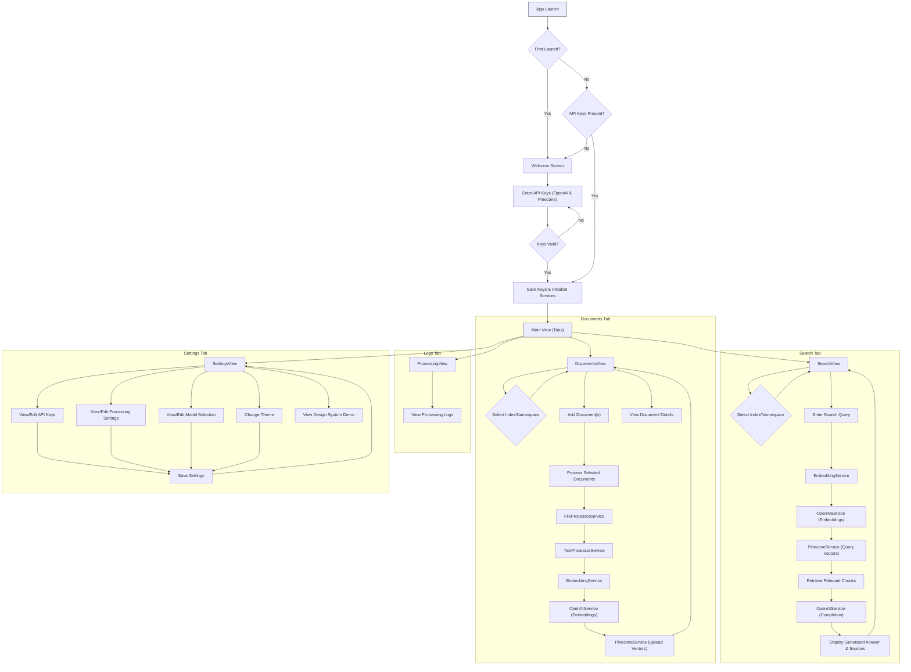

<div align="center">
<h1 align="center">
<!-- TODO: Add a relevant project icon/logo here -->
<!--  -->
<br>
OpenCone
</h1>
<h3 align="center">📍 iOS Retrieval Augmented Generation (RAG) System</h3>
<h3 align="center">⚙️ Developed with the software and tools below:</h3>

<p align="center">


</p>
</div>

---

## 📚 Table of Contents

- [📚 Table of Contents](#-table-of-contents)
- [📍 Overview](#-overview)
- [✨ Key Features](#-key-features)
- [📂 Project Structure](#-project-structure)
- [🌊 Application Flow / Usage](#-application-flow--usage)
- [🚀 Getting Started](#-getting-started)
- [🤝 Contributing](#-contributing)
- [👏 Acknowledgments](#-acknowledgments)

---

## 📍 Overview

OpenCone is a native iOS application demonstrating a Retrieval Augmented Generation (RAG) system. It allows users to upload documents, process them by extracting text and generating vector embeddings using OpenAI, store these embeddings in a Pinecone vector database, and perform semantic searches across the documents to get AI-generated answers. The app is built entirely with SwiftUI and leverages Combine for asynchronous operations. It features a custom design system and theme management.

---

## ✨ Key Features

<!-- TODO: Add screenshots or GIFs showcasing your project's main features -->
**Screenshots/GIFs:**

*(Consider adding visual examples here)*

| Feature                     | Description                                                                                                |
| :-------------------------- | :--------------------------------------------------------------------------------------------------------- |
| **🌟 Document Processing**  | Upload various document types (PDF, DOCX, TXT). Text is extracted, chunked, and processed.                   |
| **🚀 Vector Embeddings**    | Generates vector embeddings for text chunks using OpenAI's models (e.g., `text-embedding-3-large`).          |
| **🔧 Pinecone Integration** | Stores and indexes vector embeddings in a Pinecone vector database for efficient similarity search.          |
| **📊 Semantic Search**      | Perform natural language searches across processed documents. Retrieves relevant chunks based on semantic similarity. |
| **🧠 RAG Implementation**   | Uses retrieved document chunks as context for OpenAI's completion models (e.g., `gpt-4o`) to generate answers. |
| **🎨 Custom Design System** | Features a custom UI library (`OCDesignSystem`) with components like `OCButton`, `OCCard`, `OCBadge`, etc.    |
| **⚙️ Settings Management**  | Configure API keys (OpenAI, Pinecone), processing parameters (chunk size, overlap), and model selection.   |
| **📜 Processing Logs**      | View detailed logs of document processing steps and status updates.                                        |
| **🎨 Theme Customization**  | Select different visual themes for the application interface.                                              |

---

## 📂 Project Structure

OpenCone follows the MVVM (Model-View-ViewModel) architectural pattern combined with a service layer for handling external interactions and business logic.

```mermaid
graph TD

    %% Define CSS classes for styling subgraphs
    classDef viewStyle fill:#cde4ff,stroke:#333,stroke-width:2px
    classDef viewModelStyle fill:#ccffcc,stroke:#333,stroke-width:2px
    classDef serviceStyle fill:#fff0cc,stroke:#333,stroke-width:2px
    classDef modelStyle fill:#ffcccc,stroke:#333,stroke-width:2px
    classDef externalStyle fill:#e0e0e0,stroke:#333,stroke-width:2px

    %% Define subgraphs with simple IDs and descriptive labels
    subgraph viewLayer ["View Layer (SwiftUI)"]
        direction LR
        MainView([MainView])
        DocumentsView([DocumentsView])
        SearchView([SearchView])
        SettingsView([SettingsView])
        ProcessingView([ProcessingView])
        WelcomeView([WelcomeView])
        DesignSystemDemoView([DesignSystemDemoView])
        ThemeSettingsView([ThemeSettingsView])
        DocumentDetailsView([DocumentDetailsView])
        DocumentRow([DocumentRow])
        LogEntryRow([LogEntryRow])
        SettingsNavigationRow([SettingsNavigationRow])
        SecureSettingsField([SecureSettingsField])
        OCButton([OCButton])
        OCCard([OCCard])
        OCBadge([OCBadge])
    end

    subgraph viewModelLayer ["ViewModel Layer (Combine)"]
        direction LR
        DocumentsViewModel([DocumentsViewModel])
        SearchViewModel([SearchViewModel])
        SettingsViewModel([SettingsViewModel])
        ProcessingViewModel([ProcessingViewModel])
    end

    subgraph serviceLayer ["Service Layer"]
        direction LR
        FileProcessorService([FileProcessorService])
        TextProcessorService([TextProcessorService])
        EmbeddingService([EmbeddingService])
        OpenAIService([OpenAIService])
        PineconeService([PineconeService])
        Logger([Logger])
        ThemeManager([ThemeManager])
    end

    subgraph modelLayer ["Model Layer"]
        direction LR
        DocumentModel([DocumentModel])
        ProcessingLogEntry([ProcessingLogEntry])
        SearchResultModel([SearchResultModel])
        Configuration([Configuration])
        OCTheme([OCTheme])
        OCDesignSystem([OCDesignSystem])
    end

    subgraph externalServices ["External Services"]
        OpenAI_API["OpenAI API"]
        Pinecone_API["Pinecone API"]
        FileSystem["iOS File System"]
    end

    %% View -> ViewModel Connections
    DocumentsView --> DocumentsViewModel
    SearchView --> SearchViewModel
    SettingsView --> SettingsViewModel
    ProcessingView --> ProcessingViewModel
    WelcomeView --> SettingsViewModel
    ThemeSettingsView --> ThemeManager

    %% ViewModel -> Service Connections
    DocumentsViewModel --> FileProcessorService
    DocumentsViewModel --> TextProcessorService
    DocumentsViewModel --> EmbeddingService
    DocumentsViewModel --> PineconeService
    DocumentsViewModel --> Logger
    SearchViewModel --> PineconeService
    SearchViewModel --> OpenAIService
    SearchViewModel --> EmbeddingService
    SearchViewModel --> Logger
    SettingsViewModel --> Logger
    ProcessingViewModel --> Logger

    %% Service -> External/Internal Connections
    FileProcessorService --> FileSystem
    EmbeddingService --> OpenAIService
    OpenAIService --> OpenAI_API
    PineconeService --> Pinecone_API
    ConsoleFile["Console/File"]
    Logger --> ConsoleFile

    %% Components Usage
    DocumentsView -.-> DocumentRow
    DocumentsView -.-> OCCard
    DocumentsView -.-> OCButton
    SearchView -.-> OCCard
    SearchView -.-> OCButton
    SettingsView -.-> SettingsNavigationRow
    SettingsView -.-> SecureSettingsField
    SettingsView -.-> OCCard
    SettingsView -.-> OCButton
    ProcessingView -.-> LogEntryRow
    DesignSystemDemoView -.-> OCButton
    DesignSystemDemoView -.-> OCCard
    DesignSystemDemoView -.-> OCBadge
    ThemeSettingsView -.-> OCCard

    %% Apply classes to subgraphs
    class viewLayer viewStyle
    class viewModelLayer viewModelStyle
    class serviceLayer serviceStyle
    class modelLayer modelStyle
    class externalServices externalStyle
```



- **`OpenCone/`**: Root directory for the application source code.
  - **`App/`**: Contains the main application entry point (`OpenConeApp.swift`), the main tab view (`MainView.swift`), and the initial setup/welcome view (`WelcomeView.swift`).
  - **`Assets.xcassets/`**: Stores app assets like the icon and accent colors.
  - **`Core/`**: Foundational code shared across features.
    - `Configuration.swift`: Centralized configuration (API keys from environment, default settings).
    - `Logger.swift`: Simple logging utility.
    - `ProcessingLogEntry.swift`: Data model for log entries.
    - **`DesignSystem/`**: Defines the custom UI theme and components.
      - `Color+Extensions.swift`: Color utility extensions (e.g., hex initializer).
      - `OCDesignSystem.swift`: Defines spacing, sizing, and animation constants.
      - `OCTheme.swift`: Data structure for theme properties (colors).
      - `ThemeEnvironment.swift`: SwiftUI environment key for accessing the current theme.
      - `ThemeManager.swift`: Manages the active theme and provides theme options.
      - **`Components/`**: Reusable SwiftUI view components (`OCBadge`, `OCButton`, `OCCard`).
    - **`Extensions/`**: Utility extensions for standard Swift/SwiftUI types (e.g., `Binding+Extensions`).
  - **`Features/`**: Contains distinct feature modules of the app.
    - **`Documents/`**: Document management, processing initiation, and details view.
      - `DocumentsView.swift`: Main view for the Documents tab.
      - `DocumentsViewModel.swift`: Handles logic for document loading, processing, and Pinecone configuration.
      - `DocumentModel.swift`: Data model for documents.
      - `DocumentRow.swift`: SwiftUI view for displaying a single document item.
      - `DocumentDetailsView.swift`: View showing detailed stats about a processed document.
      - `DocumentPicker.swift`: UIKit view controller wrapper for picking documents.
    - **`ProcessingLog/`**: Displays logs generated during document processing.
      - `ProcessingView.swift`: Main view for the Logs tab.
      - `ProcessingViewModel.swift`: Manages log entries and filtering.
    - **`Search/`**: Semantic search interface and results display.
      - `SearchView.swift`: Main view for the Search tab.
      - `SearchViewModel.swift`: Handles search queries, embedding generation, Pinecone querying, and RAG answer generation.
    - **`Settings/`**: Application settings management.
      - `SettingsView.swift`: Main view for the Settings tab.
      - `SettingsViewModel.swift`: Manages API keys, processing parameters, and model selection.
      - `SecureSettingsField.swift`: Custom view for securely displaying/editing sensitive fields.
      - `SettingsNavigationRow.swift`: Reusable row component for navigation within settings.
      - `ThemeSettingsView.swift`: View for selecting the application theme.
      - `DesignSystemDemoView.swift`: View showcasing the custom design system components.
  - **`Preview Content/`**: Assets and data specifically for SwiftUI previews.
    - `PreviewData.swift`: Provides sample data for previews.
  - **`Services/`**: Contains services responsible for specific tasks like API interaction or complex logic.
    - `EmbeddingService.swift`: Handles interaction with OpenAI for generating embeddings.
    - `FileProcessorService.swift`: Responsible for reading and extracting text from files.
    - `OpenAIService.swift`: Handles interaction with OpenAI's completion and embedding APIs.
    - `PineconeService.swift`: Handles interaction with the Pinecone vector database API.
    - `TextProcessorService.swift`: Responsible for chunking text content.
- **`OpenCone.xcodeproj/`**: Xcode project file and associated workspace/configuration data.
- **`cline_docs/`**: Documentation generated or used by development tools (e.g., codebase summaries, roadmap).
- **`README.md`**: This file.

---

## 🌊 Application Flow / Usage



1.  **Launch**: The app checks if it's the first launch or if API keys are missing.
2.  **Setup (if needed)**: The `WelcomeView` guides the user through entering OpenAI and Pinecone API keys and the Pinecone Project ID.
3.  **Initialization**: Core services (`OpenAIService`, `PineconeService`, `EmbeddingService`) and ViewModels are initialized using the provided keys.
4.  **Main Interface (`MainView`)**: A tab view provides access to Documents, Search, Logs, and Settings.
5.  **Documents Tab (`DocumentsView`)**:
    - Select a Pinecone index and optional namespace. Create new indexes if needed.
    - Add documents using the system document picker.
    - Select documents and tap "Process".
    - Processing involves: Text extraction (`FileProcessorService`), chunking (`TextProcessorService`), embedding generation (`EmbeddingService` -> `OpenAIService`), and vector upload (`PineconeService`).
    - View processing status and details for each document.
6.  **Search Tab (`SearchView`)**:
    - Select the Pinecone index and namespace to search within.
    - Enter a natural language query.
    - The query is embedded (`EmbeddingService` -> `OpenAIService`).
    - Pinecone is queried for similar vectors (`PineconeService`).
    - Relevant text chunks are retrieved.
    - The chunks and original query are sent to `OpenAIService` for answer generation (RAG).
    - The generated answer and source chunks are displayed.
7.  **Logs Tab (`ProcessingView`)**: View a stream of logs generated during document processing.
8.  **Settings Tab (`SettingsView`)**:
    - View and update API keys and Pinecone Project ID.
    - Adjust document processing parameters (chunk size, overlap).
    - Select the OpenAI models used for embeddings and completions.
    - Change the application's visual theme.
    - Access a demo of the custom design system components.

---

## 🚀 Getting Started

**Prerequisites:**

- macOS with Xcode installed (check project for minimum required version).
- An Apple Developer account (for running on a physical device).
- OpenAI API Key.
- Pinecone API Key and Project ID.

**Installation & Running:**

1.  Clone the repository:
    ```bash
    git clone https://github.com/gunnarhostetler/OpenCone.git
    cd OpenCone
    ```
2.  **Configure API Keys**: OpenCone expects API keys to be available. You have a few options:
    *   **Environment Variables (Recommended for Simulators/Local Builds):** Set the following environment variables in your Xcode scheme's "Run" arguments:
        *   `OPENAI_API_KEY`: Your OpenAI API key.
        *   `PINECONE_API_KEY`: Your Pinecone API key (must start with `pcsk_`).
        *   `PINECONE_PROJECT_ID`: Your Pinecone Project ID.
        *   *How to set:* In Xcode, go to Product > Scheme > Edit Scheme... > Select the "Run" phase > Arguments > Environment Variables. Add the keys and their values.
    *   **Directly in `Configuration.swift` (Not Recommended for Production/Sharing):** You could temporarily hardcode the keys in `OpenCone/Core/Configuration.swift`, but **avoid committing these changes**.
    *   **User Defaults (via Settings):** The app allows entering keys via the Settings tab or the initial Welcome screen. These are stored in UserDefaults (Note: For production, Keychain is preferred for secure storage, but UserDefaults is used here for simplicity).

3.  Open the project in Xcode:
    ```bash
    open OpenCone.xcodeproj
    ```
4.  Select a target device (Simulator or physical device).
5.  Build and run the application (Cmd+R).
6.  If it's the first launch or keys weren't provided via environment variables, the Welcome screen will prompt you to enter them.

---

## 🤝 Contributing

Currently, contributions are not actively solicited, but feel free to fork the repository and experiment. If you find bugs or have suggestions, you can open an issue on the GitHub repository.

---

## 👏 Acknowledgments

- **SwiftUI & Combine**: Apple's frameworks for building the user interface and handling asynchronous events.
- **OpenAI**: For providing the powerful language models used for embeddings and completions.
- **Pinecone**: For the efficient vector database service enabling semantic search.
- **Inspiration**: Concepts drawn from various RAG implementations and best practices in iOS development.

---
