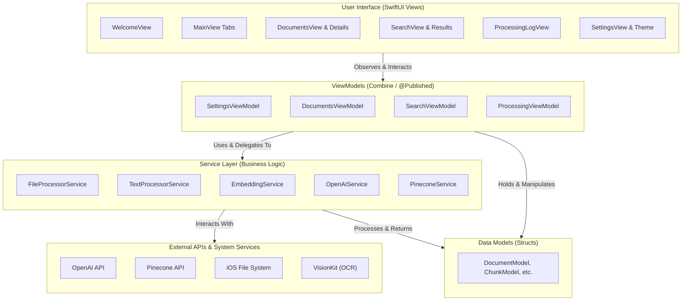

OpenCone is a sophisticated, native iOS application designed to empower users to process, embed, and perform semantic searches on their documents directly from their iPhone or iPad. Built with SwiftUI, Combine, and modern `async/await`, it provides a seamless and reactive user experience for interacting with powerful AI models from OpenAI and Pinecone.

-----

## 📚 Table of Contents

  - [Overview](https://www.google.com/search?q=%23overview)
  - [Key Features](https://www.google.com/search?q=%23key-features)
  - [Architecture](https://www.google.com/search?q=%23architecture)
  - [Detailed Project Structure](https://www.google.com/search?q=%23detailed-project-structure)
  - [Core Application & Data Flow](https://www.google.com/search?q=%23core-application--data-flow)
  - [Core Components & Their Interactions](https://www.google.com/search?q=%23core-components--their-interactions)
  - [Potential Refinements & Considerations](https://www.google.com/search?q=%23potential-refinements--considerations)
  - [Getting Started](https://www.google.com/search?q=%23getting-started)
  - [Contributing](https://www.google.com/search?q=%23contributing)
  - [License](https://www.google.com/search?q=%23license)

-----

## Overview

OpenCone provides a complete, end-to-end Retrieval Augmented Generation (RAG) pipeline on iOS. It empowers users to transform a personal collection of documents (PDFs, DOCX, TXT, and even images) into a searchable knowledge base. The application handles text extraction (including OCR for images), intelligent text chunking, and the generation of vector embeddings via OpenAI's state-of-the-art models. These embeddings are stored and indexed in a Pinecone serverless vector database, enabling powerful semantic search capabilities. Users can ask natural language questions and receive concise, contextually-aware answers synthesized by models like GPT-4o, with clear references to the source documents. The entire experience is wrapped in a native, themable SwiftUI interface designed for both iPhone and iPad.

-----

## Key Features

| Feature | Description |
| :--- | :--- |
| **📄 Multi-Format Document Management** | Upload, manage, and process various document types including PDF, DOCX, TXT, and images. File access is securely persisted using security-scoped bookmarks. |
| **⚙️ Advanced Processing Pipeline** | An automated, multi-stage pipeline handles text extraction, MIME-type aware chunking strategies, and robust error handling for document ingestion. |
| **🚀 OpenAI Embeddings & Completions** | Generates high-dimensional vector embeddings using configurable OpenAI models (e.g., `text-embedding-3-large`) and synthesizes answers using completion models (e.g., `gpt-4o`). |
| **🌲 Pinecone Vector Database Integration** | Full lifecycle management for Pinecone serverless indexes: create, list, select an active index, and manage namespaces for organized vector storage. |
| **🔍 Semantic Search & RAG** | Perform natural language queries to retrieve semantically similar text chunks from Pinecone, which are then used as context for generating accurate AI-powered answers. |
| **📊 Detailed Processing Statistics** | View comprehensive, per-document statistics including processing phase timings (extraction, chunking, embedding, upsert), token counts, and chunk size distributions via charts. |
| **🎨 Custom Design System & Theming** | Features a bespoke, reusable UI library (`OCDesignSystem`) with custom components (`OCButton`, `OCCard`, `OCBadge`) and multiple, dynamically switchable themes (Light, Dark, Midnight, Forest). |
| **📜 Real-time, Filterable Logs** | A centralized logging system provides a detailed, filterable stream of all major operations, including document processing, API calls, and errors, with export functionality. |
| **🔑 Guided Onboarding** | A user-friendly `WelcomeView` guides new users through the initial API key configuration for OpenAI and Pinecone, ensuring a smooth setup process. |

-----

## Architecture

### **MVVM (Model-View-ViewModel) with a Service Layer**

OpenCone adheres to the **MVVM** architectural pattern to ensure a clean separation of concerns between the UI (View), state management (ViewModel), and data structures (Model). This is augmented by a dedicated **Service Layer** that abstracts away business logic, external API interactions, and complex operations, making the codebase modular and maintainable.

  * **Models**: Plain Swift `structs` that define the application's data structures (e.g., `DocumentModel`, `ChunkModel`, `ProcessingLogEntry`). They are passive and hold data.
  * **Views**: Lightweight SwiftUI `View`s responsible for presenting the UI and capturing user input. They observe ViewModels for state changes and delegate all business logic.
  * **ViewModels**: `ObservableObject` classes that act as the bridge between the Models and Views. They prepare data for display, handle user actions, and interact with the Service layer, notifying the Views of any changes via `@Published` properties.
  * **Services**: Encapsulated Swift classes that perform specific, reusable tasks, such as making API calls (`OpenAIService`, `PineconeService`), processing files (`FileProcessorService`), or generating embeddings (`EmbeddingService`).

### **Mermaid Diagram**



-----

## Detailed Project Structure

\<details\>
\<summary\>\<strong\>\<code\>📂 OpenCone/App/\</code\>\</strong\>\</summary\>

| File | Summary |
| :--- | :--- |
| `OpenConeApp.swift` | The main entry point of the application (`@main`). Manages the app's lifecycle and state transitions (e.g., loading, welcome, main view). |
| `MainView.swift` | Contains the root `TabView` that orchestrates navigation between the app's primary features: Documents, Search, Logs, and Settings. |
| `WelcomeView.swift` | The initial onboarding view shown on first launch or when API keys are missing. Guides the user through entering credentials. |

\</details\>

\<details\>
\<summary\>\<strong\>\<code\>📂 OpenCone/Core/\</code\>\</strong\>\</summary\>

| File | Summary |
| :--- | :--- |
| `Configuration.swift` | A centralized struct for static configuration values like default model names, chunk sizes, and API keys (read from environment variables for debugging). |
| `Logger.swift` | A shared singleton class for app-wide, real-time logging. Publishes log entries via Combine for UI updates. |
| `ProcessingLogEntry.swift` | The data model (`struct`) for an individual log entry, including timestamp, level, message, and context. |
| **`DesignSystem/`** | A directory containing all components of the custom UI design system. |
| `OCTheme.swift` | Defines the color palettes and properties for different visual themes (Light, Dark, Midnight, Forest). |
| `ThemeManager.swift` | A singleton `ObservableObject` that manages the active theme and applies it across the application. |
| **`Components/`** | Contains reusable, themed SwiftUI components like `OCButton`, `OCCard`, and `OCBadge`. |
| **`Extensions/`** | Contains helpful extensions on standard Swift/SwiftUI types, such as `Binding+Extensions.swift`. |

\</details\>

\<details\>
\<summary\>\<strong\>\<code\>📂 OpenCone/Features/\</code\>\</strong\>\</summary\>

| File | Summary |
| :--- | :--- |
| **`Documents/`** | The complete module for document management and processing. |
| `DocumentsView.swift` | The main UI for the Documents tab, allowing users to add, select, and process files. |
| `DocumentsViewModel.swift`| Handles all logic for the Documents tab, including orchestrating the processing pipeline and managing Pinecone index/namespace state. |
| `DocumentModel.swift` | The primary data model for a document, including its metadata and processing status. Also defines related models like `ChunkModel` and `DocumentProcessingStats`. |
| `DocumentDetailsView.swift`| A view that displays detailed processing statistics, charts, and logs for a selected document. |
| **`Search/`** | The complete module for the semantic search feature. |
| `SearchView.swift` | The main UI for the Search tab, including the search bar, configuration options, and results display. |
| `SearchViewModel.swift` | Handles the entire RAG flow: embedding the user's query, querying Pinecone, and generating a final answer via OpenAI completions. |
| **`ProcessingLog/`** | The module for displaying real-time application logs. |
| `ProcessingView.swift` | The UI for the Logs tab, displaying a filterable list of all log entries from the shared `Logger`. |
| **`Settings/`** | The module for managing application settings. |
| `SettingsView.swift` | The main UI for the Settings tab, allowing users to configure API keys, processing parameters, and AI models. |
| `SettingsViewModel.swift`| Manages the state and persistence (`UserDefaults`) of all application settings. |

\</details\>

\<details\>
\<summary\>\<strong\>\<code\>📂 OpenCone/Services/\</code\>\</strong\>\</summary\>

| File | Summary |
| :--- | :--- |
| `FileProcessorService.swift` | Responsible for all file I/O, including reading files, extracting text content from PDFs (`PDFKit`) and images (`VisionKit` OCR), and determining MIME types. |
| `TextProcessorService.swift`| Responsible for chunking text content using MIME-type specific strategies, counting tokens (`NLTokenizer`), and generating content hashes. |
| `OpenAIService.swift` | Handles all direct communication with the OpenAI API for creating embeddings and generating chat completions, including request/response models. |
| `PineconeService.swift` | Manages all interactions with the Pinecone API, including index/namespace management, vector upsertion, and querying, with built-in retry and rate-limiting logic. |
| `EmbeddingService.swift` | Orchestrates the process of generating vector embeddings by taking text chunks, interacting with `OpenAIService`, and converting the results into Pinecone-ready vectors. |

\</details\>

-----

## Core Application & Data Flow

  * **App Initialization & Setup**: On launch, `OpenConeApp.swift` checks `UserDefaults` for a `hasLaunchedBefore` flag. If it's the first launch, or if required API keys are missing, the app state transitions to `.welcome`, showing the `WelcomeView`. Otherwise, it attempts to initialize the core services.
  * **API Key / Configuration Management**: The `WelcomeView` and `SettingsView` both interact with `SettingsViewModel` to manage API keys and other parameters. `SettingsViewModel` persists this data to `UserDefaults`. The core services (`OpenAIService`, `PineconeService`) are initialized with these keys.
  * **Main Navigation**: Once initialized, the app state becomes `.main`, and the `MainView` is presented. This view contains a `TabView` that serves as the primary navigation between the `Documents`, `Search`, `ProcessingLog`, and `Settings` features.
  * **Data Fetching & Display**: The application follows a reactive data flow. For example, in the `DocumentsView`, user actions trigger methods in the `DocumentsViewModel`. This ViewModel calls one or more services (e.g., `PineconeService.listIndexes()`). Upon receiving a result, the ViewModel updates its `@Published` properties (e.g., `pineconeIndexes`). The `DocumentsView`, which observes the ViewModel, automatically re-renders its UI to reflect the new state.
  * **User Interactions & Actions**: A typical user action, such as tapping the "Process" button in `DocumentsView`, initiates a complex, asynchronous workflow managed by the `DocumentsViewModel`. It calls `FileProcessorService` to extract text, `TextProcessorService` to create chunks, `EmbeddingService` to generate vectors, and finally `PineconeService` to upsert them. Throughout this process, the ViewModel updates `@Published` properties like `isProcessing` and `processingProgress`, providing real-time feedback to the user.

-----

## Core Components & Their Interactions

  * **API Service Layer**: `OpenAIService` and `PineconeService` are the foundation of the app's external communication. They encapsulate all network request logic, authentication, and response decoding for their respective APIs. They are designed to be stateless and are injected as dependencies into other services and ViewModels that require them.
  * **Authentication Flow**: The app's "authentication" is the initial setup flow managed by `WelcomeView` and `SettingsViewModel`. It ensures that the application has the necessary API keys to function before allowing the user to proceed to the main interface. There is no traditional user login system.
  * **Document Processing Pipeline**: This is the core workflow of the app, primarily orchestrated by `DocumentsViewModel`. It chains together calls to `FileProcessorService` (text extraction), `TextProcessorService` (chunking), `EmbeddingService` (vector generation), and `PineconeService` (storage). The flow is designed to be asynchronous and provides continuous feedback to the UI.
  * **Settings Management**: The `SettingsView` provides a UI for all user-configurable parameters. It binds directly to `@Published` properties in the `SettingsViewModel`, which handles the logic for loading and saving these settings to `UserDefaults`.
  * **Data Persistence Layer**: Persistence is handled in two ways:
    1.  **Settings & Keys**: `UserDefaults` is used for storing non-sensitive configuration and API keys (with a documented recommendation to migrate to Keychain).
    2.  **File Access**: To maintain access to user-selected files across app launches (a requirement of the iOS sandbox), `DocumentsViewModel` creates and stores security-scoped bookmarks in the `DocumentModel`.

-----

## Potential Refinements & Considerations

1.  **Enhance Security**: Migrate API key storage from `UserDefaults` to the **Keychain**. While `UserDefaults` is convenient, Keychain provides hardware-backed encryption and is the standard for securely storing sensitive secrets on iOS.
2.  **Increase Unit Test Coverage**: The project currently lacks a dedicated test target. Adding unit tests for the Service layer and business logic within the ViewModels would significantly improve code quality, prevent regressions, and make future refactoring safer.
3.  **Optimize Memory Management for Large Files**: While `autoreleasepool` is used during chunking, processing extremely large documents (\>100MB) could still lead to memory pressure. Implementing a streaming or line-by-line processing approach in `FileProcessorService` and `TextProcessorService` would make the app more robust.
4.  **Improve Accessibility**: Enhance the application for users with disabilities by adding accessibility labels, hints, and values to all SwiftUI views. Ensure proper focus order and support for Dynamic Type and VoiceOver.

-----

## Getting Started

### Prerequisites

  * **Xcode**: 15.0 or later
  * **Swift**: 5.9+
  * **iOS**: 15.0 or later
  * **Accounts**:
      * An Apple Developer account (for on-device deployment).
      * An OpenAI API Key.
      * A Pinecone API Key and Project ID (from a **Serverless** project).

### Installation & Setup

1.  **Clone the Repository**:

    ```bash
    git clone https://github.com/gunnarhostetler/OpenCone.git
    cd OpenCone
    ```

2.  **Provide API Keys**:
    You have two options to configure the required API keys:

      * **(In-App)**: Build and run the app. The initial welcome screen will prompt you to enter your OpenAI and Pinecone credentials.
      * **(Environment Variables for Xcode)**:
        1.  In Xcode, go to **Product → Scheme → Edit Scheme...**
        2.  Select the **Run** action, then go to the **Arguments** tab.
        3.  In the "Environment Variables" section, add the following:
              * `OPENAI_API_KEY`: `your_openai_api_key`
              * `PINECONE_API_KEY`: `your_pinecone_api_key`
              * `PINECONE_PROJECT_ID`: `your_pinecone_project_id`

3.  **Run the App**:
    Open `OpenCone.xcodeproj` in Xcode, select an iOS Simulator or a connected device, and press **Cmd+R** to build and run.

-----

## Contributing

Contributions are welcome\! Please fork the repository and submit a pull request with your proposed changes. For major features, please open an issue first to discuss what you would like to change.

-----

## License

This project is licensed under the MIT License. See the `LICENSE` file for details.
