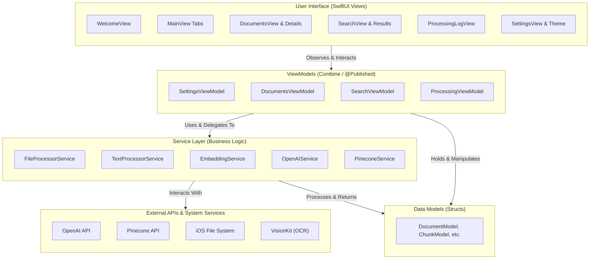

# OpenCone: On-Device RAG for iOS

OpenCone is a sophisticated, native iOS application designed to empower users to process, embed, and perform semantic searches on their documents directly from their iPhone or iPad. Built with SwiftUI, Combine, and modern `async/await`, it provides a seamless and reactive user experience for interacting with powerful AI models from OpenAI and Pinecone.

---

## 📚 Table of Contents

- [Overview](#overview)
- [Key Features](#key-features)
- [Architecture](#architecture)
- [Detailed Project Structure](#detailed-project-structure)
- [Core Application & Data Flow](#core-application--data-flow)
- [Core Components & Their Interactions](#core-components--their-interactions)
- [Potential Refinements & Considerations](#potential-refinements--considerations)
- [Getting Started](#getting-started)
- [Contributing](#contributing)
- [License](#license)

---

## Overview

OpenCone provides a complete, end-to-end Retrieval Augmented Generation (RAG) pipeline on iOS. It empowers users to transform a personal collection of documents (PDFs, DOCX, TXT, and even images) into a searchable knowledge base. The application handles text extraction (including OCR for images), intelligent text chunking, and the generation of vector embeddings via OpenAI's state-of-the-art models. These embeddings are stored and indexed in a Pinecone serverless vector database, enabling powerful semantic search capabilities. Users can ask natural language questions and receive concise, contextually-aware answers synthesized by models like GPT-4o, with clear references to the source documents. The entire experience is wrapped in a native, themable SwiftUI interface designed for both iPhone and iPad.

---

## Key Features

| Feature                                     | Description                                                                                                                                                                                      |
| :------------------------------------------ | :----------------------------------------------------------------------------------------------------------------------------------------------------------------------------------------------- |
| **📄 Multi-Format Document Management**     | Upload, manage, and process various document types including PDF, DOCX, TXT, and images. File access is securely persisted using security-scoped bookmarks.                                      |
| **⚙️ Advanced Processing Pipeline**         | An automated, multi-stage pipeline handles text extraction, MIME-type aware chunking strategies, and robust error handling for document ingestion.                                               |
| **🚀 OpenAI Embeddings & Completions**      | Generates high-dimensional vector embeddings using configurable OpenAI models (e.g., `text-embedding-3-large`) and synthesizes answers using completion models (e.g., `gpt-4o`).                 |
| **🌲 Pinecone Vector Database Integration** | Full lifecycle management for Pinecone serverless indexes: create, list, select an active index, and manage namespaces for organized vector storage.                                             |
| **🔍 Semantic Search & RAG**                | Perform natural language queries to retrieve semantically similar text chunks from Pinecone, which are then used as context for generating accurate AI-powered answers.                          |
| **📊 Detailed Processing Statistics**       | View comprehensive, per-document statistics including processing phase timings (extraction, chunking, embedding, upsert), token counts, and chunk size distributions via charts.                 |
| **🎨 Custom Design System & Theming**       | Features a bespoke, reusable UI library (`OCDesignSystem`) with custom components (`OCButton`, `OCCard`, `OCBadge`) and multiple, dynamically switchable themes (Light, Dark, Midnight, Forest). |
| **📜 Real-time, Filterable Logs**           | A centralized logging system provides a detailed, filterable stream of all major operations, including document processing, API calls, and errors, with export functionality.                    |
| **🔑 Guided Onboarding**                    | A user-friendly `WelcomeView` guides new users through the initial API key configuration for OpenAI and Pinecone, ensuring a smooth setup process.                                               |

---

## Architecture

### **MVVM (Model-View-ViewModel) with a Service Layer**

OpenCone adheres to the **MVVM** architectural pattern to ensure a clean separation of concerns between the UI (View), state management (ViewModel), and data structures (Model). This is augmented by a dedicated **Service Layer** that abstracts away business logic, external API interactions, and complex operations, making the codebase modular and maintainable.

- **Models**: Plain Swift `structs` that define the application's data structures (e.g., `DocumentModel`, `ChunkModel`, `ProcessingLogEntry`). They are passive and hold data.
- **Views**: Lightweight SwiftUI `View`s responsible for presenting the UI and capturing user input. They observe ViewModels for state changes and delegate all business logic.
- **ViewModels**: `ObservableObject` classes that act as the bridge between the Models and Views. They prepare data for display, handle user actions, and interact with the Service layer, notifying the Views of any changes via `@Published` properties.
- **Services**: Encapsulated Swift classes that perform specific, reusable tasks, such as making API calls (`OpenAIService`, `PineconeService`), processing files (`FileProcessorService`), or generating embeddings (`EmbeddingService`).

### **Mermaid Diagram**



---

## Detailed Project Structure

### 📂 `OpenCone/App/`

| File                | Summary                                                                                                                                   |
| :------------------ | :---------------------------------------------------------------------------------------------------------------------------------------- |
| `OpenConeApp.swift` | The main entry point of the application (`@main`). Manages the app's lifecycle and state transitions (e.g., loading, welcome, main view). |
| `MainView.swift`    | Contains the root `TabView` that orchestrates navigation between the app's primary features: Documents, Search, Logs, and Settings.       |
| `WelcomeView.swift` | The initial onboarding view shown on first launch or when API keys are missing. Guides the user through entering credentials.             |

### 📂 `OpenCone/Core/`

| File                       | Summary                                                                                                                                                   |
| :------------------------- | :-------------------------------------------------------------------------------------------------------------------------------------------------------- |
| `Configuration.swift`      | A centralized struct for static configuration values like default model names, chunk sizes, and API keys (read from environment variables for debugging). |
| `Logger.swift`             | A shared singleton class for app-wide, real-time logging. Publishes log entries via Combine for UI updates.                                               |
| `ProcessingLogEntry.swift` | The data model (`struct`) for an individual log entry, including timestamp, level, message, and context.                                                  |
| **`DesignSystem/`**        | A directory containing all components of the custom UI design system.                                                                                     |
| `OCTheme.swift`            | Defines the color palettes and properties for different visual themes (Light, Dark, Midnight, Forest).                                                    |
| `ThemeManager.swift`       | A singleton `ObservableObject` that manages the active theme and applies it across the application.                                                       |
| **`Components/`**          | Contains reusable, themed SwiftUI components like `OCButton`, `OCCard`, and `OCBadge`.                                                                    |
| **`Extensions/`**          | Contains helpful extensions on standard Swift/SwiftUI types, such as `Binding+Extensions.swift`.                                                          |

### 📂 `OpenCone/Features/`

| File                        | Summary                                                                                                                                                           |
| :-------------------------- | :---------------------------------------------------------------------------------------------------------------------------------------------------------------- |
| **`Documents/`**            | The complete module for document management and processing.                                                                                                       |
| `DocumentsView.swift`       | The main UI for the Documents tab, allowing users to add, select, and process files.                                                                              |
| `DocumentsViewModel.swift`  | Handles all logic for the Documents tab, including orchestrating the processing pipeline and managing Pinecone index/namespace state.                             |
| `DocumentModel.swift`       | The primary data model for a document, including its metadata and processing status. Also defines related models like `ChunkModel` and `DocumentProcessingStats`. |
| `DocumentDetailsView.swift` | A view that displays detailed processing statistics, charts, and logs for a selected document.                                                                    |
| **`Search/`**               | The complete module for the semantic search feature.                                                                                                              |
| `SearchView.swift`          | The main UI for the Search tab, including the search bar, configuration options, and results display.                                                             |
| `SearchViewModel.swift`     | Handles the entire RAG flow: embedding the user's query, querying Pinecone, and generating a final answer via OpenAI completions.                                 |
| **`ProcessingLog/`**        | The module for displaying real-time application logs.                                                                                                             |
| `ProcessingView.swift`      | The UI for the Logs tab, displaying a filterable list of all log entries from the shared `Logger`.                                                                |
| **`Settings/`**             | The module for managing application settings.                                                                                                                     |
| `SettingsView.swift`        | The main UI for the Settings tab, allowing users to configure API keys, processing parameters, and AI models.                                                     |
| `SettingsViewModel.swift`   | Manages the state and persistence (`UserDefaults`) of all application settings.                                                                                   |

### 📂 `OpenCone/Services/`

| File                         | Summary                                                                                                                                                                   |
| :--------------------------- | :------------------------------------------------------------------------------------------------------------------------------------------------------------------------ |
| `FileProcessorService.swift` | Responsible for all file I/O, including reading files, extracting text content from PDFs (`PDFKit`) and images (`VisionKit` OCR), and determining MIME types.             |
| `TextProcessorService.swift` | Responsible for chunking text content using MIME-type specific strategies, counting tokens (`NLTokenizer`), and generating content hashes.                                |
| `OpenAIService.swift`        | Handles all direct communication with the OpenAI API for creating embeddings and generating chat completions, including request/response models.                          |
| `PineconeService.swift`      | Manages all interactions with the Pinecone API, including index/namespace management, vector upsertion, and querying, with built-in retry and rate-limiting logic.        |
| `EmbeddingService.swift`     | Orchestrates the process of generating vector embeddings by taking text chunks, interacting with `OpenAIService`, and converting the results into Pinecone-ready vectors. |

---

## Core Application & Data Flow

### **1. Application Lifecycle & State Machine**

The application's entry point, `OpenConeApp.swift`, manages the overall state of the UI through a simple state machine defined by the `AppState` enum.

- **`@main` `OpenConeApp`**:
  - On launch, it immediately checks for the presence of required API keys (`OpenAI` and `Pinecone`) in `UserDefaults`.
  - **`AppState`**:
    - `.loading`: The initial state while keys are being verified.
    - `.welcome`: If any key is missing, the app transitions to this state, presenting the `WelcomeView` to prompt the user for their credentials.
    - `.main`: Once keys are validated, the app transitions to the main `TabView` (`MainView`), unlocking the core features.
    - `.error`: A state for handling critical, unrecoverable errors (though not explicitly used in the main flow).
  - This state-driven approach ensures that users cannot access features that depend on APIs without first providing the necessary configuration.

### **2. The Asynchronous Document Processing Pipeline**

The core of OpenCone's functionality is its robust, asynchronous pipeline for ingesting documents. This process is primarily orchestrated by the `DocumentsViewModel` and involves several services.

- **Trigger**: The user selects one or more files via the `DocumentPicker` (a `UIViewControllerRepresentable` wrapper for `UIDocumentPickerViewController`).
- **`DocumentsViewModel.handlePickedDocuments(urls:)`**:
  1.  **Security-Scoped Access**: For each URL, it secures persistent, sandboxed access to the file.
  2.  **`DocumentModel` Creation**: A `DocumentModel` is created for each file to track its state (`.pending`, `.processing`, `.completed`, `.failed`).
  3.  **Asynchronous Processing**: It kicks off a `Task` for each document to perform the processing concurrently.
- **`processDocument(document:)` (within `DocumentsViewModel`)**:
  1.  **File Processing (`FileProcessorService`)**:
      - Reads the file data.
      - Extracts raw text. This is a critical step that uses `PDFKit` for PDFs and `VisionKit`'s OCR capabilities for images, making the app highly versatile.
  2.  **Text Processing (`TextProcessorService`)**:
      - The extracted text is intelligently split into smaller pieces (`ChunkModel`) based on the file's MIME type to ensure semantic coherence.
      - A unique hash is generated for the document's content to prevent re-processing identical files.
  3.  **Embedding Generation (`EmbeddingService` & `OpenAIService`)**:
      - The text chunks are sent to the OpenAI API via `OpenAIService` to be converted into numerical vector embeddings.
      - This process is batched to handle API rate limits gracefully.
  4.  **Vector Upsert (`PineconeService`)**:
      - The resulting vectors, along with their metadata (source document ID, chunk text), are "upserted" (uploaded) into the user's selected Pinecone index and namespace.
- **Real-time Feedback**: Throughout this entire pipeline, the `Logger` service is called at the beginning and end of each major step (e.g., "Starting text extraction," "Completed embedding generation"). The `ProcessingView` observes these log entries via Combine and displays them in real-time, providing the user with transparent, detailed feedback on the app's activity.

### **3. Retrieval Augmented Generation (RAG)**

The `SearchViewModel` orchestrates the RAG flow, which turns a user's question into a well-supported answer.

- **Trigger**: The user types a query into the `SearchView` and submits it.
- **`SearchViewModel.performSearch()`**:
  1.  **Query Embedding (`OpenAIService`)**: The user's natural language query is first converted into a vector embedding using the same OpenAI model that was used for the documents.
  2.  **Vector Search (`PineconeService`)**: This new query vector is sent to the Pinecone API. Pinecone performs a similarity search and returns the top `k` most semantically similar vectors from the index.
  3.  **Context Aggregation**: The `SearchViewModel` retrieves the original text chunks associated with the vectors returned by Pinecone. This text forms the "context" for the final answer.
  4.  **Answer Synthesis (`OpenAIService`)**: The original query and the retrieved context are combined into a carefully crafted prompt. This prompt is sent to an OpenAI completion model (like `gpt-4o`), which generates a concise, synthesized answer based _only_ on the provided information.
  5.  **Display**: The final answer and its source chunks are displayed in the `SearchView`.

---

## Core Components & Their Interactions

### **Dependency Injection**

- The application employs a manual form of Dependency Injection. The primary services (`OpenAIService`, `PineconeService`, etc.) are instantiated once in `OpenConeApp` and passed down to the ViewModels that need them (e.g., `MainView` creates `DocumentsViewModel` and injects the required services). This promotes loose coupling and makes components easier to test or replace.

### **State Management**

- **Application State**: Managed by the `AppState` enum in `OpenConeApp.swift`, controlling the top-level view hierarchy.
- **View State**: Each feature's state is managed by its corresponding `ViewModel` (e.g., `DocumentsViewModel`, `SearchViewModel`). These `ObservableObject`s use `@Published` properties to drive UI updates in their respective SwiftUI `View`s.
- **Shared State**:
  - **`ThemeManager`**: A shared `ObservableObject` singleton that manages the application's current theme. Any view can subscribe to it to react to theme changes.
  - **`Logger`**: A shared singleton that centralizes all log messages. It uses a Combine `PassthroughSubject` to broadcast new `ProcessingLogEntry` items to any interested subscribers, most notably the `ProcessingViewModel`.

### **Real-time, Reactive Logging System**

A key architectural feature is the centralized, reactive logging system, which provides exceptional observability into the app's operations.

- **`Logger.swift` (Singleton)**:
  - Contains a `public static let shared` instance, making it accessible from anywhere in the app (ViewModels, Services, etc.).
  - Features a Combine `PassthroughSubject<ProcessingLogEntry, Never>`, which acts as a broadcast channel for log messages.
  - The `log(...)` method creates a `ProcessingLogEntry` and sends it through the subject.
- **`ProcessingViewModel.swift`**:
  - In its initializer, it subscribes to the `Logger.shared.logEntryPublisher`.
  - It maintains a `@Published var logEntries: [ProcessingLogEntry]` array.
  - Using a `.sink` operator, it appends each new log entry received from the publisher to its `logEntries` array.
- **`ProcessingView.swift`**:
  - Observes the `ProcessingViewModel`.
  - The UI automatically updates via SwiftUI's declarative nature whenever the `logEntries` array in the ViewModel changes.

This setup decouples the log _producers_ (any component that calls `Logger.log(...)`) from the log _consumer_ (`ProcessingViewModel`), creating a highly efficient and real-time feedback mechanism for the user.

---

## Potential Refinements & Considerations

- **Formal Dependency Injection Container**: While manual injection works, a library like `Swinject` could formalize dependency management, especially if the object graph becomes more complex.
- **Error Handling Granularity**: Error handling could be made more granular, with custom error types for different failure modes (e.g., `PineconeError`, `OpenAIError`) to provide more specific feedback to the user.
- **State Persistence**: Beyond `UserDefaults` for settings, using Core Data or SwiftData could provide a more robust solution for persisting `DocumentModel` objects and their states across app launches.
- **Background Processing**: For very large files, implementing `BGProcessingTask` from the BackgroundTasks framework would allow the processing pipeline to continue even if the user backgrounds the app.

---

## Getting Started

1.  **Clone the Repository**:
    ```bash
    git clone https://github.com/your-username/OpenCone.git
    cd OpenCone
    ```
2.  **Open the Project**:
    - Open `OpenCone.xcodeproj` in Xcode.
3.  **Configure API Keys**:
    - The app requires API keys for OpenAI and Pinecone. For local debugging, these can be set as environment variables in the Xcode scheme.
    - Go to **Product > Scheme > Edit Scheme...**
    - Select the **Run** action and go to the **Arguments** tab.
    - Add the following to the "Environment Variables" section:
      - `OPENAI_API_KEY`: Your secret key from OpenAI.
      - `PINECONE_API_KEY`: Your secret key from Pinecone.
4.  **Build and Run**:
    - Select a target simulator or a physical device and press the Run button.

---

## Contributing

Contributions are welcome! Please feel free to submit a pull request or open an issue for any bugs, feature requests, or improvements.

---

## License

This project is licensed under the MIT License. See the `LICENSE` file for details.
