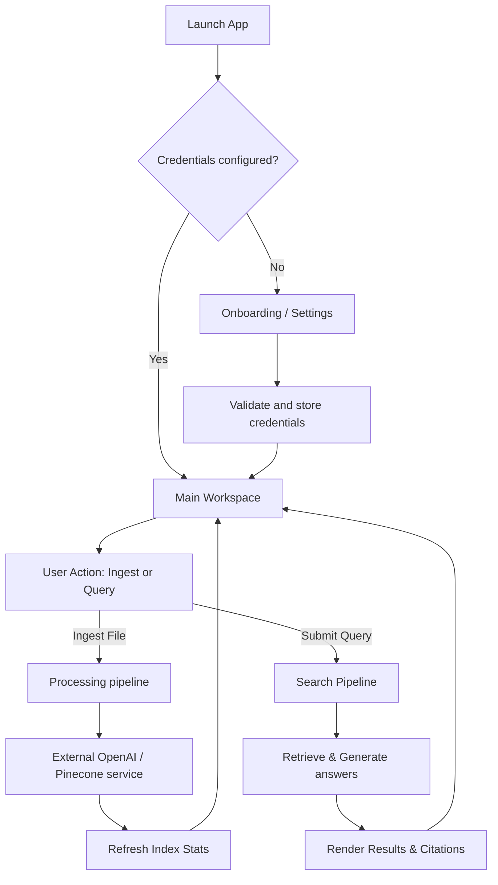
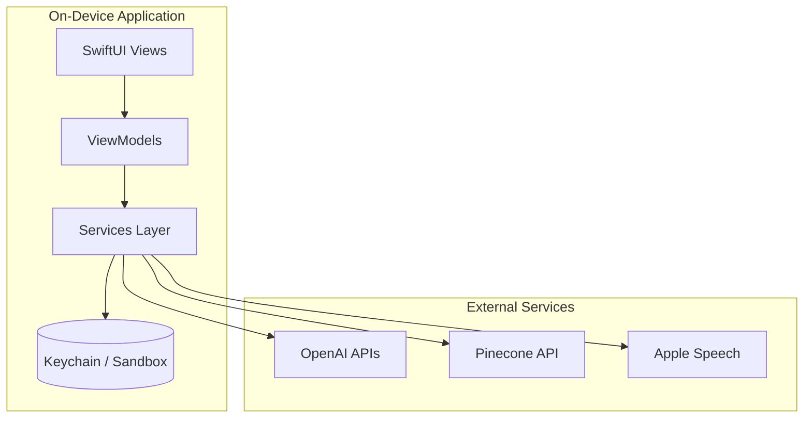
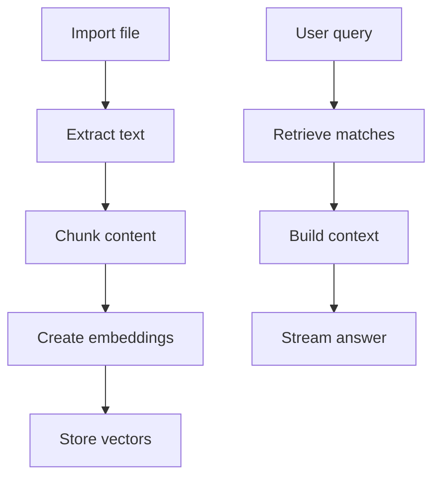
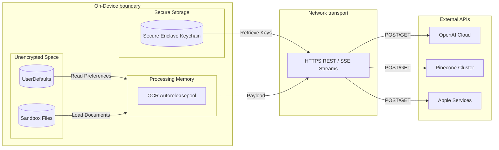

# OpenCone

<p align="center">
  
</p>

<p align="center">
    <strong>Cloud-hybrid Retrieval Augmented Generation (RAG) client for Apple platforms, built with SwiftUI, local document processing, OpenAI, and Pinecone.</strong>
</p>

<p align="center">
  <a href="https://apps.apple.com/us/app/opencone/id6744467668">
    
  </a>
  
  
  
</p>

---

## Overview
OpenCone is a local-first front end and cloud-hybrid RAG client designed to transform personal documents (PDFs, Word docs, plain text, code scripts, and images) into a searchable knowledge base backed by user-owned OpenAI and Pinecone accounts. Designed for researchers, engineers, and privacy-conscious professionals, the app parses local files, extracts text (utilizing Vision OCR where necessary), recursively chunks content using MIME-aware rules, embeds them via OpenAI, and persists indexing vectors inside a serverless Pinecone database.

During queries, OpenCone executes semantic vector lookup against Pinecone, performs reranking, manages local session memory, and streams grounded responses from OpenAI's Responses API token-by-token. It operates as a native Apple client over a cloud-backed RAG stack, integrating MIME-aware parsing pipelines, rate-limited Pinecone clients with circuit-breaker protection, Apple's Speech Recognition framework for voice query input, and dynamic theme synchronization.

---

## Product Snapshot

| Dimension | Detail |
|---|---|
| Platform | iOS / iPadOS / macOS Catalyst |
| Language | Swift |
| UI | SwiftUI |
| Architecture | MVVM-S |
| Primary APIs | OpenAI (Embeddings, Responses API), Pinecone REST API, Apple Speech/Vision |
| Storage | Secure Enclave Keychain (`SecureSettingsStore`), `UserDefaults`, Sandbox Files |
| App Store | [Download](https://apps.apple.com/us/app/opencone/id6744467668) |
| Status | Active |
| License | [MIT](LICENSE) |

---

## Key Capabilities

- **MIME-Aware Ingestion Pipeline**: Extracts structured text from multiple formats, utilizing `PDFKit` for PDF pages and Apple's native `Vision` OCR framework for images before cloud indexing begins.
- **On-Device Security-Scoped Access**: Employs sandboxed bookmarks (`startAccessingSecurityScopedResource`) to retain file read permissions across system relaunches without prompts.
- **Resilient Pinecone & OpenAI Client**: Coordinates exponential backoff retries, request rate limiting (100ms pauses), and an automatic circuit-breaker to gracefully handle vector-store throttling or region failures.
- **Advanced RAG Capabilities**: Orchestrates hybrid searches (combining dense embeddings and sparse keyword vectors), custom metadata presets, and multi-model rerankers (`bge-reranker-v2-m3`, `cohere-rerank-3.5`, `pinecone-rerank-v0`).
- **Real-Time Token Streaming**: Implements Server-Sent Events (SSE) parsing to fetch incremental response deltas directly from OpenAI's Responses API.
- **Speech-to-Text Transcription**: Connects `AVAudioEngine` input taps and Apple's Speech Recognition API to transcribe microphone audio with responsive UI waveform animation.
- **Bespoke Theme System**: Centralizes look-and-feel variables under a theme environment manager, supplying customized Light and Dark color palettes.

---

## How It Works

OpenCone handles checking API credentials, onboarding validation, local file processing, vector upsert, and subsequent semantic search querying.


```mermaid
flowchart TD
    A[Launch App] --> B{Credentials configured?}
    B -->|No| C[Onboarding / Settings]
    B -->|Yes| D[Main Workspace]
    C --> E[Validate and store credentials]
    E --> D
    D --> F[User Action: Ingest or Query]
    F -->|Ingest File| G[Processing pipeline]
    F -->|Submit Query| J[Search Pipeline]
    G --> H[External OpenAI / Pinecone service]
    H --> I[Refresh Index Stats]
    I --> D
    J --> K[Retrieve & Generate answers]
    K --> L[Render Results & Citations]
    L --> D
```

---

## Architecture

OpenCone adheres to an MVVM-S architecture. The view layer binds to view models, which coordinate backend actions through specialized services. For detailed file-level relationships and dependency mappings, see [ARCHITECTURE.md](ARCHITECTURE.md).


```mermaid
flowchart TD
    subgraph Device["On-Device Application"]
        UI[SwiftUI Views] --> VM[ViewModels]
        VM --> SVC[Services Layer]
        SVC --> Store[(Keychain / Sandbox)]
    end
    subgraph Cloud["External Services"]
        SVC --> OAI[OpenAI APIs]
        SVC --> PCN[Pinecone API]
        SVC --> APL[Apple Speech]
    end
```

### Key Technical Decisions

| Decision | Rationale | Tradeoff |
|---|---|---|
| **Keychain for Keys** | Prevents developers or users from writing credentials to plain text configs. | Restricts automated simulator testing unless environment scheme overrides are supplied. |
| **Circuit Breaker** | Opens automatically after N network failures to prevent UI locks and API rate exhaustion. | Requires index switches or cooldown timers to reset. |
| **MIME-Aware Splitter** | Preserves logical structures (Markdown headers, JSON nodes) in chunks. | Increased parsing complexity per document type. |
| **Security Bookmarks** | Stores file references so documents can be re-accessed securely across launches. | Requires user storage provider permission consent. |
| **Autoreleasepool for OCR** | Manages high heap overhead of image recognition frames on memory-restricted iOS devices. | Slightly increases execution duration during serial processing. |
| **Speech Audio Tap** | Uses `AVAudioEngine` for low-latency voice streaming. | Demands microphone and speech recognition permissions. |
| **Host/Stats Caching** | Caches Pinecone cluster endpoints and namespace stats with short TTLs. | Brief delays (10s-30s) in reflecting out-of-band index changes. |

---

## Core Workflows

OpenCone coordinates file ingestion (extracting text locally, generating embeddings, and upserting vectors) and Retrieval-Augmented Generation (querying vector databases and streaming answers).


```mermaid
flowchart TD
    A[Import file] --> B[Extract text]
    B --> C[Chunk content]
    C --> D[Create embeddings]
    D --> E[Store vectors]
    F[User query] --> G[Retrieve matches]
    G --> H[Build context]
    H --> I[Stream answer]
```

### 1. Ingestion & Processing Details
- **Ingestion**: Documents are selected via the native document picker. Bookmarks are resolved dynamically with security permissions enabled (`startAccessingSecurityScopedResource`). Supported MIME types include PDFs, DOCX, TXT, HTML, CSS, Markdown, JSON, XML, CSV, TSV, RTF, and images.
- **Extraction**: Text is extracted locally using `PDFKit` page extraction or `Vision` framework OCR. Large processing loops run inside `autoreleasepool` to prevent memory leaks during image OCR.
- **Chunking**: Text is split recursively using `RecursiveTextSplitter`. Chunk sizes (default `1024` chars) and overlaps (default `256` chars) adapt based on file types.
- **Deduplication & Batching**: SHA256 hashes are calculated on document contents to guarantee ingestion idempotency. Embeddings are created in batches of 50 to avoid API thread exhaustion.

### 2. Retrieval & Generation Details
- **Query Embedding**: User prompt texts or voice transcription tokens are converted into embeddings matching the dimension of document vectors (3072 by default).
- **Vector Search**: Performs similarity searches against Pinecone index namespaces, supporting custom metadata filters ($eq, $in, $gte, $lte, $contains).
- **Hybrid Search & Reranking**: Combines dense semantic search and sparse keyword lists using a simple alpha slider. Matches can be refined using BGE, Cohere, or Pinecone inference models.
- **Answer Streaming**: Grounded context is formatted and submitted to the OpenAI Responses API. Tokens stream into the chat view in real time via Server-Sent Events (SSE). OpenAI `web_search` and `code_interpreter` tools are conditionally activated using text-based heuristics.

---

## Data Flow

This chart defines the boundaries between local device memory, Keychain credentials, the network payload transport layer, and external cloud APIs.


```mermaid
flowchart LR
    subgraph LocalDevice["On-Device boundary"]
        subgraph SafeStorage["Secure Storage"]
            KC[(Secure Enclave Keychain)]
        end
        subgraph PlainStorage["Unencrypted Space"]
            UD[(UserDefaults)]
            SB[(Sandbox Files)]
        end
        subgraph LogicMemory["Processing Memory"]
            MEM[OCR Autoreleasepool]
        end
    end

    subgraph Net["Network transport"]
        HTTPS[HTTPS REST / SSE Streams]
    end

    subgraph Cloud["External APIs"]
        OAI[OpenAI Cloud]
        PCN[Pinecone Cluster]
        APL[Apple Services]
    end

    %% Flows
    KC -->|Retrieve Keys| HTTPS
    UD -->|Read Preferences| LogicMemory
    SB -->|Load Documents| LogicMemory
    LogicMemory -->|Payload| HTTPS
    HTTPS -->|POST/GET| OAI & PCN & APL
```

---

## File Entry Points

| Concern | Files | Responsibility |
|---|---|---|
| **App Entry** | [OpenConeApp.swift](OpenCone/App/OpenConeApp.swift) | Bootstrapping, AppState machine, and Release credential check. |
| **Main UI** | [MainView.swift](OpenCone/App/MainView.swift) | Tab routing (Search, Documents, Logs, Settings) and view-model synchronization. |
| **Ingestion View** | [DocumentsViewRedesign.swift](OpenCone/Features/Documents/DocumentsViewRedesign.swift) | Document list, dashboards, and bulk action triggers. |
| **Ingestion Engine** | [DocumentsViewModel.swift](OpenCone/Features/Documents/DocumentsViewModel.swift) | Pipeline scheduling, progress tracking, and bookmarks updates. |
| **API Clients** | [PineconeService.swift](OpenCone/Services/PineconeService.swift), [OpenAIService.swift](OpenCone/Services/OpenAIService.swift) | Low-level REST connections, retry logic, SSE parsing, and circuit breakers. |
| **Text Splitter** | [TextProcessorService.swift](OpenCone/Services/TextProcessorService.swift) | Content tokenization, recursive chunking, and hashing. |
| **Audio Capture** | [SpeechRecognitionService.swift](OpenCone/Services/SpeechRecognitionService.swift) | Speech-to-text translation and real-time amplitude tracking. |
| **Security Store** | [SecureSettingsStore.swift](OpenCone/Core/Security/SecureSettingsStore.swift) | Keychain storage for OpenAI/Pinecone keys and version settings. |
| **Unit Tests** | [SearchViewModelMetadataPersistenceTests.swift](OpenConeTests/SearchViewModelMetadataPersistenceTests.swift) | Validates filter settings storage and JSON parsing. |

---

## Configuration

| Setting | Storage | Default | Required | Purpose |
|---|---|---|---|---|
| `OPENAI_API_KEY` | Keychain | None | Yes | OpenAI API requests (embeddings & completions). |
| `PINECONE_API_KEY` | Keychain | None | Yes | Pinecone database request authorization. |
| `PINECONE_PROJECT_ID` | Keychain | None | Yes | Targets Pinecone host resolutions. |
| `PINECONE_CLOUD` | Keychain | `aws` | No | Target host environment configuration. |
| `PINECONE_REGION` | Keychain | `us-east-1` | No | Targets serverless regions. |
| `defaultChunkSize` | UserDefaults | `1024` | No | Character count limit for text segmentation. |
| `defaultChunkOverlap`| UserDefaults | `256` | No | Chunk duplication boundary. |
| `completionModel` | UserDefaults | `gpt-4o` | No | Model ID used for text completion. |
| `searchTopK` | UserDefaults | `10` | No | Nearest-neighbor vector counts retrieved. |
| `hybridAlpha` | UserDefaults | `0.5` | No | Sparse vs dense search weighting (`1.0`=semantic, `0.0`=keyword). |

---

## Build & Run

### Prerequisites
- macOS Sonoma or Sequoia
- Xcode 16.0+
- iOS 17.0+ Simulator or physical device
- Active OpenAI and Pinecone Accounts

### Setup
1. **Clone the repository**:
   ```bash
   git clone https://github.com/Gunnarguy/OpenCone.git
   cd OpenCone
   open OpenCone.xcodeproj
   ```
2. **Configure schemes (optional for debug)**:
   Select **Product > Scheme > Edit Scheme... > Run > Arguments**. Add these environment variables:
   - `OPENAI_API_KEY`
   - `PINECONE_API_KEY`
   - `PINECONE_PROJECT_ID`

3. **Install Dependencies**:
   OpenCone relies on Apple's standard native frameworks (PDFKit, Vision, SFSpeechRecognizer) and integrates standard packages via Swift Package Manager (managed directly by Xcode). No Cocoapods or Carthage setups are necessary.

4. **Build and Run**:
   Press **Cmd+R** to build. If keys are missing, the guided welcome flow validation will assist with Keychain entries.

---

## Testing

| Validation | Command / Procedure | Expected Result |
|---|---|---|
| **Build Project** | `xcodebuild -project OpenCone.xcodeproj -scheme OpenCone -destination "platform=iOS Simulator,name=iPhone 16" build` | Compilation completes with no errors. |
| **Unit Tests** | `xcodebuild test -project OpenCone.xcodeproj -scheme OpenCone -destination "platform=iOS Simulator,name=iPhone 16" -quiet` | All unit tests pass successfully. |
| **Secret Scan** | `python3 scripts/secret_scan.py` | Prints `✅ No secret patterns detected.` and exits with code 0. |
| **Preflight check** | `scripts/preflight_check.sh` | Performs all scans, Plist verification, and runs tests. |
| **Manual Ingestion** | Run app, pick a PDF/image, inspect logs in Logs tab | Ingestion log shows success and vector counts update on dashboard. |
| **Manual RAG Search** | Enter query matching ingested file, inspect citations | Streams completion citing source names and chunks. |

---

## Privacy & Security
- **Local Sandbox**: Documents, bookmark descriptions, extraction steps, and logging occur strictly in the app sandbox.
- **Network Boundaries**: Chunked document content and related metadata are sent to OpenAI and Pinecone for embeddings, vector storage, search, and answer generation. OpenCone is not a fully offline RAG system.
- **Credentials Enclave**: Keys reside in the Enclave Keychain. Release builds throw a `fatalError` if secrets are hardcoded in variables.
- **Data Disposal**: Users can delete individual docs (clearing vector entries from Pinecone) or execute a full clean slate from **Settings > Data & Privacy > Reset Stored Keys & Preferences**.

*For more details, see [PRIVACY.md](PRIVACY.md) and [SECURITY.md](SECURITY.md).*

---

## Documentation

| Document | Purpose |
|---|---|
| [Architecture](ARCHITECTURE.md) | System design, data flow, and service boundaries |
| [Security](SECURITY.md) | Secret handling, local storage, and release checks |
| [Privacy](PRIVACY.md) | Data storage, API transmission, and user controls |
| [Roadmap](ROADMAP.md) | Current status, planned work, and known gaps |
| [App Store Notes](APP_STORE.md) | App Store metadata, review notes, and release checklist |
| [Case Study](docs/CASE_STUDY.md) | Engineering retrospective and implementation notes |

---

## Roadmap

### Completed
- [x] On-device multi-format text extraction (PDF, text, images with Vision OCR).
- [x] Secure Settings Store Keychain integration and release-build secret safeguards.
- [x] Speech Recognition service integration with dynamic level animation.
- [x] Circuit breaker logic, exponential backoff retries, and rate limits for Pinecone query robustness.
- [x] Two-stage RAG queries supporting hybrid retrieval and reranking.

### In Progress
- [ ] Automated integration test coverage for streaming completions.
- [ ] Circuit breaker user status notifications.

### Planned
- [ ] Local embedding caching to avoid redundant OpenAI API calls.
- [ ] Bookmark-aware file update detection.
- [ ] Spotlights indexing for ingested document records.

---

## License
OpenCone is distributed under the [MIT License](LICENSE).
