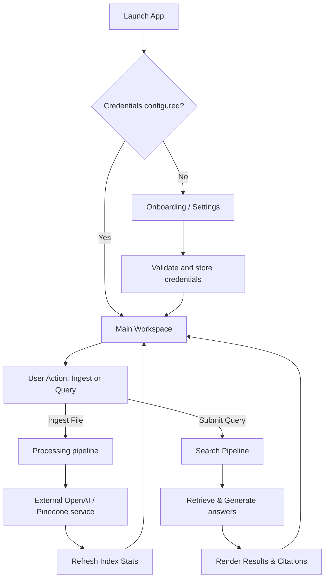
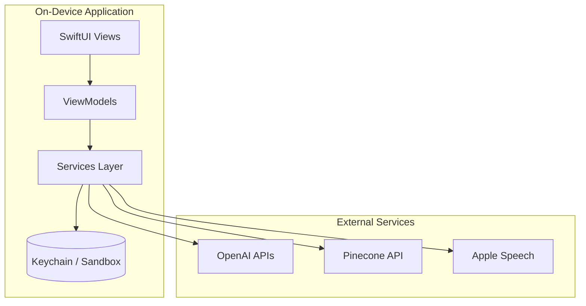
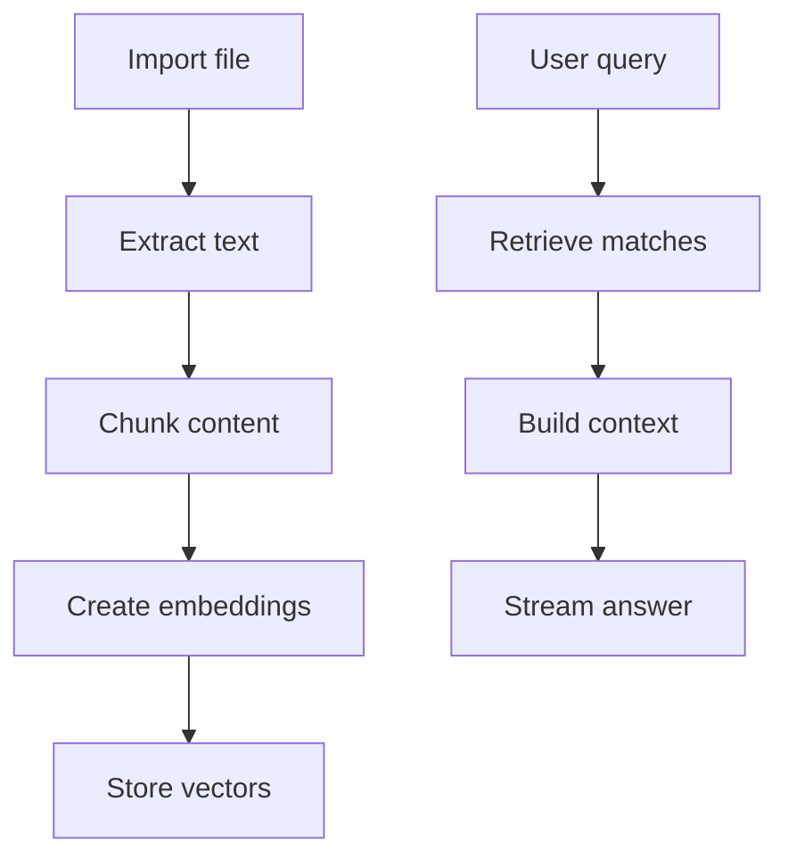
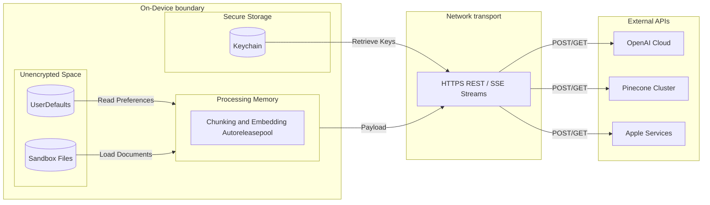

# OpenCone

<p align="center">
  
</p>

<p align="center">
    <strong>Cloud-hybrid Retrieval Augmented Generation (RAG) client for iPhone, built with SwiftUI, local document processing, OpenAI, and Pinecone.</strong>
</p>

<p align="center">
  <a href="https://apps.apple.com/us/app/opencone/id6744467668">
    
  </a>
  
  
  
</p>

The App Store has version 3.0. This README describes `main`, which is version 3.1, in App Review since October 1, 2026.

---

## Overview
OpenCone is a cloud-hybrid RAG client designed to transform personal documents (PDFs, plain text, JavaScript, and CSS) into a searchable knowledge base backed by user-owned OpenAI and Pinecone accounts. Designed for researchers, engineers, and privacy-conscious professionals, the app parses local files, extracts text, recursively chunks content using MIME-aware rules, embeds them via OpenAI, and persists indexing vectors inside a serverless Pinecone database.

During queries, OpenCone executes semantic vector lookup against Pinecone, performs reranking, manages local session memory, and streams grounded responses from OpenAI's Responses API token-by-token. It operates as a native Apple client over a cloud-backed RAG stack, integrating MIME-aware parsing pipelines, rate-limited Pinecone clients with circuit-breaker protection, Apple's Speech Recognition framework for voice query input, and an interface that follows the system's light or dark appearance, laid out like OpenResponses so the two apps look and work alike.

---

## Product Snapshot

| Dimension | Detail |
|---|---|
| Platform | iOS 17.6+, iPhone |
| Language | Swift |
| UI | SwiftUI |
| Architecture | MVVM-S |
| Primary APIs | OpenAI (Embeddings, Responses API), Pinecone REST API, Apple Speech |
| Storage | Keychain (`SecureSettingsStore`), `UserDefaults`, Sandbox Files |
| App Store | [Download](https://apps.apple.com/us/app/opencone/id6744467668) |
| Status | Active |
| License | [MIT](LICENSE) |

---

## Key Capabilities

- **MIME-Aware Ingestion Pipeline**: Extracts structured text from multiple formats, utilizing `PDFKit` for PDF pages before cloud indexing begins.
- **On-Device Security-Scoped Access**: Employs sandboxed bookmarks (`startAccessingSecurityScopedResource`) to retain file read permissions across system relaunches without prompts.
- **Resilient Pinecone & OpenAI Client**: Coordinates exponential backoff retries, request rate limiting (100ms pauses), and an automatic circuit-breaker to gracefully handle vector-store throttling or region failures.
- **Three Search Widths**: Ask > Where to search. **Auto**: the model picks where to search through one function tool that the app runs with the person's own Pinecone key, up to 5 places a question, including both sides of a compare-and-contrast. **Everything**: every namespace of every index, up to 20 searches a question, with the best passages kept across all of them. **One index**: one namespace, or each namespace of the index. Every index is searched with the OpenAI embedding model that built it, and any index can be left out.
- **Advanced RAG Capabilities**: Orchestrates custom metadata presets and multi-model rerankers (`bge-reranker-v2-m3`, `cohere-rerank-3.5`, `pinecone-rerank-v0`). The query path supports hybrid weighting, but documents are uploaded with dense vectors only, so results come from semantic similarity today.
- **Real-Time Token Streaming**: Implements Server-Sent Events (SSE) parsing to fetch incremental response deltas directly from OpenAI's Responses API.
- **Speech-to-Text Transcription**: Connects `AVAudioEngine` input taps and Apple's Speech Recognition API to transcribe microphone audio with responsive UI waveform animation.
- **Readable, Checkable Answers**: Answers render their Markdown (headings, lists, tables, quotes, code blocks with a copy button). Every passage an answer cites carries a tag such as [S2]; tapping a tag or a source chip opens that passage with its document, index, namespace, page and score.
- **OpenResponses Layout**: The Ask screen uses OpenResponses' status bar (model, reasoning effort and tool badges, answer settings), bubbles, composer and model picker. Settings use its segmented tabs (General, Answers, Advanced).

---

## How It Works

OpenCone handles checking API credentials, onboarding validation, local file processing, vector upsert, and subsequent semantic search querying.


```mermaid
flowchart TD
    A[Launch App] --> B{Credentials configured?}
    B -->|No| C[Onboarding / Settings]
    B -->|Yes| D[Main Workspace]
    C --> E[Validate and store credentials]
    E --> D
    D --> F[User Action: Ingest or Query]
    F -->|Ingest File| G[Processing pipeline]
    F -->|Submit Query| J[Search Pipeline]
    G --> H[External OpenAI / Pinecone service]
    H --> I[Refresh Index Stats]
    I --> D
    J --> K[Retrieve & Generate answers]
    K --> L[Render Results & Citations]
    L --> D
```

---

## Architecture

OpenCone adheres to an MVVM-S architecture. The view layer binds to view models, which coordinate backend actions through specialized services. For detailed file-level relationships and dependency mappings, see [ARCHITECTURE.md](ARCHITECTURE.md).


```mermaid
flowchart TD
    subgraph Device["On-Device Application"]
        UI[SwiftUI Views] --> VM[ViewModels]
        VM --> SVC[Services Layer]
        SVC --> Store[(Keychain / Sandbox)]
    end
    subgraph Cloud["External Services"]
        SVC --> OAI[OpenAI APIs]
        SVC --> PCN[Pinecone API]
        SVC --> APL[Apple Speech]
    end
```

### Key Technical Decisions

| Decision | Rationale | Tradeoff |
|---|---|---|
| **Keychain for Keys** | Prevents developers or users from writing credentials to plain text configs. | Restricts automated simulator testing unless environment scheme overrides are supplied. |
| **Circuit Breaker** | Opens automatically after N network failures to prevent UI locks and API rate exhaustion. | Requires index switches or cooldown timers to reset. |
| **MIME-Aware Splitter** | Varies chunk size and overlap by MIME type; every type splits on paragraphs, lines, sentences, then words. | Increased parsing complexity per document type. |
| **Security Bookmarks** | Stores file references so documents can be re-accessed securely across launches. | Requires user storage provider permission consent. |
| **Speech Audio Tap** | Uses `AVAudioEngine` for low-latency voice streaming. | Demands microphone and speech recognition permissions. |
| **Host/Stats Caching** | Caches Pinecone cluster endpoints and namespace stats with short TTLs. | Delays of up to 5 minutes in reflecting out-of-band index changes. |

---

## Core Workflows

OpenCone coordinates file ingestion (extracting text locally, generating embeddings, and upserting vectors) and Retrieval-Augmented Generation (querying vector databases and streaming answers).


```mermaid
flowchart TD
    A[Import file] --> B[Extract text]
    B --> C[Chunk content]
    C --> D[Create embeddings]
    D --> E[Store vectors]
    F[User query] --> G[Retrieve matches]
    G --> H[Build context]
    H --> I[Stream answer]
```

### 1. Ingestion & Processing Details
- **Ingestion**: Documents are selected via the native document picker. Bookmarks are resolved dynamically with security permissions enabled (`startAccessingSecurityScopedResource`). Supported MIME types include PDFs, TXT, HTML, CSS, JavaScript, Markdown, JSON, XML, CSV, and RTF. Word, Excel and PowerPoint files cannot be extracted, so the picker no longer offers them; images are read with on-device text recognition. Some text types are rejected because their MIME type is not on the accepted list: Python (`.py`, `text/x-python-script`), TSV (`text/tab-separated-values`), and source files that iOS gives no MIME type, such as `.swift`.
- **Extraction**: Text is extracted locally using `PDFKit` page extraction, or read directly as UTF-8 for text formats. Chunking and embedding loops run inside `autoreleasepool`.
- **Chunking**: Text is split recursively using `RecursiveTextSplitter`. Chunk sizes (default `1024` chars) and overlaps (default `256` chars) adapt based on file types.
- **Deduplication & Batching**: SHA256 hashes are calculated on document contents to guarantee ingestion idempotency. Embeddings are created in batches of 50 to avoid API thread exhaustion.

### 2. Retrieval & Generation Details
- **Routing**: Before searching, a short, non-streamed Responses API call offers the model a `search_index` tool that lists each index's one-line summary and its namespaces. The app checks the model's calls (an offered index, an existing namespace, at most 5), embeds each query with the model that built that index, runs the searches in parallel, and labels every passage with its index and namespace. Summaries are drafted from a sample of each index's passages and can be rewritten by opening the index under Ask > Where to search. To learn which model built an index, the app re-embeds one stored passage and keeps the model that reproduces its stored vector. Metadata filters apply only to searches of the open index, since their field names belong to it. This is the Auto width. Everything skips the model call: it searches every namespace of every included index with the question itself, takes each search's best passage first, then each one's second, and reranks the lot once when reranking is on. Scores from different indexes aren't on one scale, so without reranking every search's best passage reaches the answer (at least 8 passages, at most 20). One index searches the open index, in its chosen namespace or in each namespace (the 10 largest), and keeps the best matches across them.
- **Query Embedding**: User prompt texts or voice transcription tokens are converted into embeddings matching the dimension of document vectors (3072 by default).
- **Vector Search**: Performs similarity searches against Pinecone index namespaces, supporting custom metadata filters ($eq, $in, $gte, $lte, $contains).
- **Hybrid Search & Reranking**: The query path supports hybrid weighting with a simple alpha slider, but documents are uploaded with dense vectors only, so results come from semantic similarity today. Matches can be refined using BGE, Cohere, or Pinecone inference models.
- **Answer Streaming**: Grounded context is formatted and submitted to the OpenAI Responses API. Tokens stream into the chat view in real time via Server-Sent Events (SSE). `web_search` and `code_interpreter` are off by default and enabled in Settings; `code_interpreter` is also gated by a keyword heuristic, and left out for the two models that lack it (GPT-5.4 Pro and GPT-5.2 Pro). Settings > Answers sets the longest answer (up to each model's own maximum: 128,000 tokens for GPT-5 and GPT-6, 32,768 for GPT-4.1, 16,384 for GPT-4o), the detail (`text.verbosity`), the service tier (Auto, Standard, Flex or Fast, offered only where OpenAI prices the selected model at it), web search's results read and allowed sites, and how many earlier exchanges each question carries (4 by default, 0 to 20). The reasoning efforts offered are the selected model's own: GPT-6.1 Sol and GPT-6 Astra take Low to Max, with no Off.
- **Memory**: Each question carries its earlier exchanges from the phone, as plain text; OpenAI keeps nothing between questions (`store: false`). When the passages, the question and those exchanges would pass the model's context window, the oldest exchanges are left out. OpenAI's `truncation: auto` isn't used, because it drops from the start of the input, where the passages are.

---

## Data Flow

This chart defines the boundaries between local device memory, Keychain credentials, the network payload transport layer, and external cloud APIs.


```mermaid
flowchart LR
    subgraph LocalDevice["On-Device boundary"]
        subgraph SafeStorage["Secure Storage"]
            KC[(Keychain)]
        end
        subgraph PlainStorage["Unencrypted Space"]
            UD[(UserDefaults)]
            SB[(Sandbox Files)]
        end
        subgraph LogicMemory["Processing Memory"]
            MEM[Chunking and Embedding Autoreleasepool]
        end
    end

    subgraph Net["Network transport"]
        HTTPS[HTTPS REST / SSE Streams]
    end

    subgraph Cloud["External APIs"]
        OAI[OpenAI Cloud]
        PCN[Pinecone Cluster]
        APL[Apple Services]
    end

    %% Flows
    KC -->|Retrieve Keys| HTTPS
    UD -->|Read Preferences| LogicMemory
    SB -->|Load Documents| LogicMemory
    LogicMemory -->|Payload| HTTPS
    HTTPS -->|POST/GET| OAI & PCN & APL
```

---

## File Entry Points

| Concern | Files | Responsibility |
|---|---|---|
| **App Entry** | [OpenConeApp.swift](OpenCone/App/OpenConeApp.swift) | Bootstrapping, AppState machine, and Release credential check. |
| **Main UI** | [MainView.swift](OpenCone/App/MainView.swift) | Tabs (Ask, Documents, Settings) and view-model synchronization. The activity log is under Settings > Advanced. |
| **Ask** | [SearchView.swift](OpenCone/Features/Search/SearchView.swift), [Components/](OpenCone/Features/Search/Components) | The conversation: status bar, where to search, Markdown answers with their sources, composer. |
| **Ingestion View** | [DocumentsView.swift](OpenCone/Features/Documents/DocumentsView.swift), [DocumentDetailsView.swift](OpenCone/Features/Documents/DocumentDetailsView.swift) | Where uploads go, indexing progress, the document list, and each file's timing (read, split, embed, store). |
| **Ingestion Engine** | [DocumentsViewModel.swift](OpenCone/Features/Documents/DocumentsViewModel.swift) | Pipeline scheduling, progress tracking, and bookmarks updates. |
| **API Clients** | [PineconeService.swift](OpenCone/Services/PineconeService.swift), [OpenAIService.swift](OpenCone/Services/OpenAIService.swift) | Low-level REST connections, retry logic, SSE parsing, and circuit breakers. |
| **Text Splitter** | [TextProcessorService.swift](OpenCone/Services/TextProcessorService.swift) | Content tokenization, recursive chunking, and hashing. |
| **Audio Capture** | [SpeechRecognitionService.swift](OpenCone/Services/SpeechRecognitionService.swift) | Speech-to-text translation and real-time amplitude tracking. |
| **Security Store** | [SecureSettingsStore.swift](OpenCone/Core/Security/SecureSettingsStore.swift) | Keychain storage for OpenAI/Pinecone keys; UserDefaults for cloud, region and API versions. |
| **Request options** | [RequestSettings.swift](OpenCone/Core/RequestSettings.swift), [ModelLimits.swift](OpenCone/Core/Models/ModelLimits.swift) | The Responses options each request reads, and what each model accepts: output and context limits, verbosity, service tiers, code interpreter. |
| **Endpoints** | [APIActivity.swift](OpenCone/Core/Networking/APIActivity.swift), [EndpointsView.swift](OpenCone/Features/Settings/EndpointsView.swift) | Every OpenAI and Pinecone endpoint the app calls, with its purpose, its settings and this session's requests (Settings > Advanced > Endpoints). |
| **Unit Tests** | [SearchViewModelMetadataPersistenceTests.swift](OpenConeTests/SearchViewModelMetadataPersistenceTests.swift) | Validates filter settings storage and JSON parsing. |

---

## Configuration

| Setting | Storage | Default | Required | Purpose |
|---|---|---|---|---|
| `OPENAI_API_KEY` | Keychain | None | Yes | OpenAI API requests (embeddings & completions). |
| `PINECONE_API_KEY` | Keychain | None | Yes | Pinecone database request authorization. |
| `PINECONE_PROJECT_ID` | Keychain | None | Yes | Targets Pinecone host resolutions. |
| `PINECONE_CLOUD` | UserDefaults | `aws` | No | Where Documents creates a new index: `aws`, `gcp` or `azure`. |
| `PINECONE_REGION` | UserDefaults | `us-east-1` | No | The serverless region for a new index, from Pinecone's list for that cloud. The Starter plan creates in AWS `us-east-1` only. |
| `pinecone.metric` | UserDefaults | `cosine` | No | The similarity metric for a new index: `cosine`, `dotproduct` (needed for hybrid search) or `euclidean`. |
| `defaultChunkSize` | UserDefaults | `1024` | No | Saved preference; not read by the chunker. |
| `defaultChunkOverlap`| UserDefaults | `256` | No | Saved preference; not read by the chunker. |
| `completionModel` | UserDefaults | `gpt-6-sol` | No | Model ID used for text completion. The default and the model menu come from the model catalog shared with OpenResponses ([docs/model-catalog.md](docs/model-catalog.md)); a saved model that OpenAI has shut down moves to its documented replacement. |
| `search.maxOutputTokens` | UserDefaults | `16000` | No | The longest answer, reasoning included (`max_output_tokens`), held to the selected model's maximum. |
| `openai.verbosity` | UserDefaults | `medium` | No | `text.verbosity` (`low`, `medium`, `high`), sent to GPT-5 and later. |
| `openai.serviceTier` | UserDefaults | `auto` | No | `service_tier`: `auto` (left out), `default`, `flex` or `fast`; a tier the model isn't offered at is left out. |
| `openai.webSearchContextSize` | UserDefaults | `medium` | No | The web search tool's `search_context_size`. |
| `openai.webSearchDomains` | UserDefaults | empty | No | The web search tool's `filters.allowed_domains`, typed as a list of sites. |
| `conversation.historyExchanges` | UserDefaults | `4` | No | Earlier exchanges sent with each question, 0 to 20. |
| `searchTopK` | UserDefaults | `10` | No | Nearest-neighbor vector counts retrieved. |
| `search.scope` | UserDefaults | `auto` | No | How widely a question is searched: `auto`, `everything` or `oneIndex`. Replaces `search.indexRoutingEnabled`, which is still written beside it. |
| `hybridAlpha` | UserDefaults | `0.5` | No | Used only when hybrid search is on and the index uses dotproduct: scales the dense query by alpha and the sparse query by 1 minus alpha. OpenCone uploads documents with dense vectors only, so any value above `0.0` ranks by semantic similarity, and `0.0` sends an all-zero dense query. |

---

## Build & Run

### Prerequisites
- macOS 27 (the version it's built and tested on)
- Xcode 27.0+
- iOS 17.6+ Simulator or physical device
- Active OpenAI and Pinecone Accounts

### Setup
1. **Clone the repository**:
   ```bash
   git clone https://github.com/Gunnarguy/OpenCone.git
   cd OpenCone
   open OpenCone.xcodeproj
   ```
2. **API keys**:
   No build reads scheme environment variables for keys; enter your keys in the app. The Release guard only refuses them: a Release build whose environment sets `OPENAI_API_KEY`, `PINECONE_API_KEY` or `PINECONE_PROJECT_ID` stops with a `fatalError` when it initializes its services.

3. **Install Dependencies**:
   OpenCone uses only Apple frameworks (PDFKit, Vision, SFSpeechRecognizer); no packages, CocoaPods or Carthage.

4. **Build and Run**:
   Press **Cmd+R** to build. If keys are missing, the guided welcome flow validation will assist with Keychain entries.

---

## Testing

The commands use a simulator named OpenCone. Create it once with `xcrun simctl create "OpenCone" "iPhone 18 Pro" com.apple.CoreSimulator.SimRuntime.iOS-27-0`.

| Validation | Command / Procedure | Expected Result |
|---|---|---|
| **Build Project** | `xcodebuild -project OpenCone.xcodeproj -scheme OpenCone -destination "platform=iOS Simulator,name=OpenCone" build` | Compilation completes with no errors. |
| **Unit Tests** | `xcodebuild test -project OpenCone.xcodeproj -scheme OpenCone -destination "platform=iOS Simulator,name=OpenCone" -quiet` | All unit tests pass successfully. |
| **Secret Scan** | `python3 scripts/secret_scan.py` | Prints `✅ No secret patterns detected.` and exits with code 0. |
| **Preflight check** | `scripts/preflight_check.sh` | Performs all scans, Plist verification, and runs tests. |
| **Manual Ingestion** | Run app, pick a PDF, inspect Settings > Advanced > Activity log | Ingestion log shows success and vector counts update on dashboard. |
| **Manual RAG Search** | Enter query matching ingested file, inspect citations | Streams completion citing source names and chunks. |

---

## Privacy & Security
- **Local Sandbox**: Documents, bookmark descriptions, extraction steps, and logging occur strictly in the app sandbox.
- **Network Boundaries**: Chunked document content and related metadata are sent to OpenAI and Pinecone for embeddings, vector storage, search, and answer generation. OpenCone is not a fully offline RAG system.
- **Credentials**: Keys reside in the Keychain. Release builds throw a `fatalError` if API keys are set as scheme environment variables.
- **Data Disposal**: Users can delete individual docs (clearing vector entries from Pinecone) or execute a full clean slate from **Settings > General > Your data > Remove keys and reset everything** (in 3.0, **Settings > Data & Privacy > Reset Stored Keys & Preferences**).

*For more details, see [PRIVACY.md](PRIVACY.md) and [SECURITY.md](SECURITY.md).*

---

## Documentation

| Document | Purpose |
|---|---|
| [Architecture](ARCHITECTURE.md) | System design, data flow, and service boundaries |
| [Security](SECURITY.md) | Secret handling, local storage, and release checks |
| [Privacy](PRIVACY.md) | Data storage, API transmission, and user controls |
| [Roadmap](ROADMAP.md) | Current status, planned work, and known gaps |
| [App Store Notes](APP_STORE.md) | App Store metadata, review notes, and release checklist |
| [Case Study](docs/CASE_STUDY.md) | Engineering retrospective and implementation notes |

---

## Roadmap

### Completed
- [x] On-device multi-format text extraction (PDF, text).
- [x] Secure Settings Store Keychain integration and release-build secret safeguards.
- [x] Speech Recognition service integration with dynamic level animation.
- [x] Circuit breaker logic, exponential backoff retries, and rate limits for Pinecone query robustness.
- [x] Two-stage RAG queries with reranking, and a hybrid query path (documents are uploaded with dense vectors only, so results come from semantic similarity today).

### In Progress
- [ ] Automated integration test coverage for streaming completions.
- [ ] Circuit breaker user status notifications.

### Planned
- [ ] Local embedding caching to avoid redundant OpenAI API calls.
- [ ] Bookmark-aware file update detection.
- [ ] Spotlights indexing for ingested document records.

---

## License
OpenCone is distributed under the [MIT License](LICENSE).
