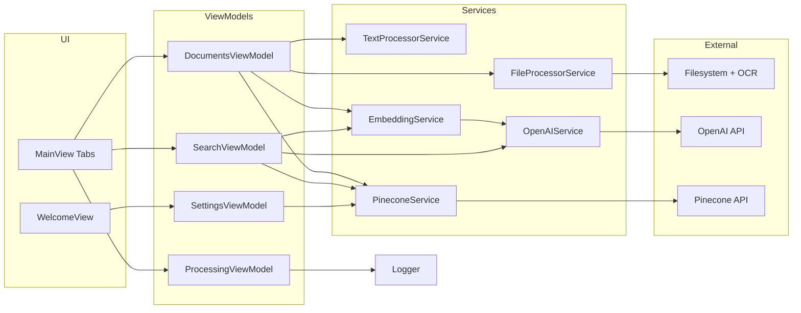

# OpenCone

On-device Retrieval Augmented Generation (RAG) for iOS, built with SwiftUI, async/await, and first-class OpenAI + Pinecone integrations.

  

---

## Table of Contents
- [Overview](#overview)
- [Feature Highlights](#feature-highlights)
- [System Architecture](#system-architecture)
- [Document Ingestion Pipeline](#document-ingestion-pipeline)
- [Search, Conversation, and RAG](#search-conversation-and-rag)
- [Key Modules](#key-modules)
- [Design System](#design-system)
- [Developer Workflow](#developer-workflow)
- [Privacy & Compliance](#privacy--compliance)
- [Getting Started](#getting-started)
- [Configuration](#configuration)
- [Manual QA Guide](#manual-qa-guide)
- [Testing](#testing)
- [Troubleshooting](#troubleshooting)
- [License](#license)

---

## Overview

OpenCone turns personal documents into a device-native knowledge base. Users ingest PDFs, Office files, plain text, code snippets, or images, and the app extracts text (with OCR support), chunks content, generates OpenAI embeddings, and stores vectors in Pinecone. Searches embed the user's query, retrieve matching chunks from Pinecone, and stream grounded answers back through OpenAI's Responses API. The entire experience is delivered through a custom SwiftUI tab interface that runs on iPhone, iPad, and macOS via Catalyst.

---

## Feature Highlights

- **Guided onboarding** - Welcome flow validates OpenAI and Pinecone credentials before unlocking the main app.
- **Multi-format ingestion** - Handles PDF, DOCX, plain text, HTML, CSV, Markdown, JSON, common image types, and code documents.
- **Security-scoped persistence** - Copies documents into the sandbox and keeps bookmarks so files remain accessible across launches.
- **Chunk-aware processing** - MIME-specific chunking with configurable size/overlap keeps semantic context intact.
- **Observability-first logs** - All pipeline stages emit structured logs to the Logs tab for instant diagnosis.
- **Search + conversation** - Runs top-k semantic search, supports server-managed and local chat history, and streams token deltas into the UI.
- **Index control** - Lists Pinecone indexes/namespaces, records recent selections, and exposes namespace stats.
- **Design system** - Theme manager, reusable components, and typography modifiers keep the UI consistent and brandable.

---

## System Architecture

OpenCone follows MVVM with a focused service layer:

- **App shell** (`OpenConeApp`) orchestrates onboarding, dependency wiring, and top-level `AppState` transitions (loading -> welcome -> main).
- **Views** (SwiftUI) subscribe to their `ObservableObject` view models and never communicate with services directly.
- **View models** coordinate user intent, call into services, and publish state updates (e.g., `DocumentsViewModel`, `SearchViewModel`, `SettingsViewModel`, `ProcessingViewModel`).
- **Services** encapsulate external interactions and heavy lifting:
  - `FileProcessorService` for text extraction (PDFKit/Vision OCR) and MIME detection.
  - `TextProcessorService` for chunk segmentation, token metrics, and hashing.
  - `EmbeddingService` for batching requests to `OpenAIService` and normalising vectors.
  - `OpenAIService` for embedding + Responses API streaming.
  - `PineconeService` for index discovery, vector upsert/query/delete, retries, and circuit breaking.
- **Shared infrastructure** includes `Logger.shared` for structured logging, `SecureSettingsStore` for Keychain-backed secrets, and `PineconePreferenceResolver` for persisting last-used index and namespace.



---

## Document Ingestion Pipeline

`DocumentsViewModel` runs a multi-stage workflow and reports granular progress for each document:

1. **Pick** - Users select files via `DocumentPicker`. URLs are secured with `startAccessingSecurityScopedResource()`.
2. **Persist** - Files copy into the sandbox (`persistDocumentCopy`) and receive a minimal bookmark for future access.
3. **Deduplicate & validate** - `makeDocumentIdentifier` combines path, size, and timestamps; duplicates or 100 MB+ files are rejected early.
4. **Extract** - `FileProcessorService` turns PDFs and images into text (PDFKit + Vision OCR) and passes through plain text/code types.
5. **Chunk** - `TextProcessorService` generates MIME-aware chunks, calculates token counts, and keeps overlap metadata.
6. **Embed** - `EmbeddingService` batches chunk text into OpenAI embedding requests, aligns with the configured dimension (3072 by default), and handles rate limits.
7. **Upsert** - `PineconeService` writes vectors with metadata (`doc_id`, chunk ranges, MIME) into the selected index/namespace.
8. **Report** - `ProcessingStats` capture phase durations and counts; logs stream to the Logs tab for transparency.

Phase weights (`phaseWeightExtraction`, `phaseWeightChunking`, `phaseWeightEmbedding`, `phaseWeightUploading`) drive the progress bar; adjust them if you insert new phases so dashboards remain accurate.

---

## Search, Conversation, and RAG

`SearchViewModel` delivers the full RAG experience:

- **Index bootstrap** - On launch, both Documents and Search view models call `PineconeService.listIndexes()`. `PineconePreferenceResolver` selects the best candidate based on history and user defaults.
- **Query embedding** - User prompts embed via `EmbeddingService`, matching the document embedding model to keep cosine similarity meaningful.
- **Vector search** - Pinecone is queried with configurable top-k (stored in `SettingsStorageKeys.searchTopK`). Metadata filters can be defined in Settings and are parsed with `PineconeMetadataFilter.parse` before each query.
- **Answer generation** - Retrieved chunks become prompt context for `OpenAIService.streamCompletion`, which streams tokens over SSE. The UI updates `messages`, `generatedAnswer`, and `answerGenerationProgress` as deltas arrive.
- **Conversation modes** - `SettingsViewModel.conversationMode` toggles between OpenAI's server-managed conversation (`conversationId` persisted in `UserDefaults`) and a client-managed short history. Both paths must continue to operate when evolving the experience.
- **Watchdogs & cancellation** - A watchdog (`Constants.watchdogDelayNanoseconds`) guards long-running streams. `currentStreamTask` is cancelled when navigating away to avoid orphaned network calls.

---

## Key Modules

- **App/** - Entry point (`OpenConeApp`), tab router (`MainView`), onboarding (`WelcomeView`), plus loading/error states.
- **Core/** - Configuration, logging, shared extensions, and the `OCDesignSystem` theme infrastructure.
- **Features/Documents/** - Document list/detail views, bookmark-aware persistence, dashboard metrics, and processing charts.
- **Features/Search/** - RAG UI, metadata filter editor, search result cards, and conversation transcript handling.
- **Features/ProcessingLog/** - Log viewer with filtering tied to `Logger.shared`.
- **Features/Settings/** - Credential management, model selection, search defaults, metadata preset editor, logging preferences, and validation flows.
- **Services/** - Pinecone/OpenAI clients, embedding orchestrator, file processing, text chunking. All network calls go through `PineconeService` and `OpenAIService` wrappers rather than ad-hoc `URLSession` usage.
- **Preview Content/** - Sample data/assets for SwiftUI previews.
- **OpenConeTests/** - Currently focused on metadata preset persistence (`SearchViewModelMetadataPersistenceTests`); extend this target when adjusting settings persistence logic.

---

## Design System

OpenCone ships with a bespoke design system located in `Core/DesignSystem`:

- `OCTheme`, `ThemeManager`, and `ThemeEnvironment` expose theme colors, typography, and gradients through `@Environment(\.theme)`.
- Components like `OCButton`, `OCCard`, `OCBadge`, input fields, and layout helpers provide consistent styling. Use them when building new surfaces.
- `ThemeManager.shared` is the single source of truth; subscribe to its `@Published` state instead of hardcoding color literals.
- `withTheme()` modifier applies theming globally from `OpenConeApp`.

---

## Developer Workflow

- **Build target** - Open `OpenCone.xcodeproj` in Xcode 16.0 or later. The project supports iOS 17+ and macOS 14+ (Catalyst).
- **Secrets** - Credentials live in `SecureSettingsStore` (Keychain). The welcome flow can store keys, or you can set environment variables in your Run scheme (`OPENAI_API_KEY`, `PINECONE_API_KEY`, `PINECONE_PROJECT_ID`).
- **Settings sync** - `SettingsViewModel` mirrors user input into `UserDefaults` and Keychain. Use `saveSettings()` after changing defaults in code so the UI reflects updates.
- **Logging** - Always log significant events via `Logger.shared.log(level:message:context:)`. The Logs tab is the canonical place to debug ingestion/search behaviour.
- **Index insights** - After upserting or deleting vectors, call `refreshIndexInsights()` to update the namespace list and index stats used by both Documents and Search tabs.
- **Background safety** - Long-running work should execute inside `Task {}`. Use `await MainActor.run {}` before mutating published state to avoid cross-actor violations.
- **Release guard** - Release builds fatal-error if `OPENAI_API_KEY`, `PINECONE_API_KEY`, or `PINECONE_PROJECT_ID` are injected via scheme overrides; clear those environment variables before archiving for TestFlight/App Store.
- **Icon generation** - Maintain `AppIcon.appiconset` by running `scripts/generate_app_icons.sh` (derives all required sizes from the 1024px marketing source).
- **Screenshot capture** - Use `scripts/capture_screenshots.sh` for guided simulator captures (prompts you to stage each screen then saves a PNG into the provided directory).

---

## Privacy & Compliance

- **Canonical docs** - `PRIVACY.md` explains on-device vs cloud processing; `AppReviewNotes.md` provides the reviewer walkthrough and credential hints.
- **Secret handling** - `SECURITY.md` outlines Keychain storage, the Release fatal guard, and the `preflight_check.sh`/`secret_scan.py` workflow.
- **Data & Privacy controls** - Settings now exposes a "Reset Stored Keys & Preferences" action that clears Keychain secrets, conversation history, and bookmark consent so testers can revoke access without deleting the app.
- **Preflight script** - Run `scripts/preflight_check.sh` before TestFlight upload; it executes `secret_scan.py`, validates Info.plist usage descriptions, confirms privacy docs include a timestamp, and runs `xcodebuild test` on the default `platform=iOS Simulator,name=iPhone 17`. Override the simulator with `OPEN_CONE_TEST_DESTINATION="platform=<custom destination>"` or skip tests temporarily with `SKIP_TESTS=1`.
- **CI guardrail** - GitHub Actions workflow `.github/workflows/preflight.yml` runs the same preflight script on macOS runners (sets `OPEN_CONE_TEST_DESTINATION` to `iPhone 15`). Keep the script fast and deterministic so PRs stay green.
- **Consent copy** - The Documents tab surfaces a security-scoped bookmark banner until acknowledged; the same language links back to `PRIVACY.md` from Settings for quick reference.

---

## Getting Started

1. **Clone and open**

    ```bash
    git clone https://github.com/Gunnarguy/OpenCone.git
    cd OpenCone
    open OpenCone.xcodeproj
    ```

2. **Configure environment variables (optional but recommended for debugging)**

    - In Xcode, choose **Product > Scheme > Edit Scheme...**
    - Under **Run > Arguments**, add environment variables:
        - `OPENAI_API_KEY`
        - `PINECONE_API_KEY`
        - `PINECONE_PROJECT_ID`

3. **Run the app**

    - Select an iOS 17+ simulator or connect a device.
    - Press **Command+R**. The welcome flow will prompt for any missing credentials and validate them in real time.

---

## Configuration

| Setting | Where to change | Notes |
| --- | --- | --- |
| OpenAI API Key | Settings tab or environment variable | Stored securely via `SecureSettingsStore`. Validation uses `CredentialValidator` with debounced checks. |
| Pinecone API Key / Project ID | Settings tab or environment variable | Keys must start with `pcsk_`; region/cloud defaults pulled from secure store. |
| Embedding model | Settings > Models | Defaults to `text-embedding-3-large` with dimension 3072. Keep in sync with Pinecone index dimensions. |
| Completion model | Settings > Models | Includes GPT-5 reasoning flag. `Configuration.isReasoningModel` toggles extra parameters. |
| Chunk size / overlap | Settings > Processing | Validate overlap < size; updates used by `TextProcessorService`. |
| Default Top K | Settings > Search | Persists to `UserDefaults` key `searchTopK`; `SearchViewModel` reads it during queries. |
| Metadata presets | Settings > Metadata Filters | Stored as JSON presets; parsed through `PineconeMetadataFilter`. Invalid entries are skipped with warnings. |
| Appearance | Theme selector (Settings) | Theme changes propagate through `ThemeManager.shared`. |

Document processing accepts the MIME types defined in `Configuration.acceptedMimeTypes`. Unsupported files surface a user-facing warning through `Logger` + `errorMessage` binding.

---

## Manual QA Guide

Run this sequence after significant changes:

1. **Fresh launch** - Delete the app, run again, walk through the welcome flow, and ensure credential validation messages appear.
2. **Ingest PDF** - Add a medium-size PDF; confirm extraction, chunking, embedding, and upsert logs appear and the namespace vector count increases.
3. **OCR path** - Import an image with text to verify Vision OCR extraction.
4. **Duplicate guard** - Add the same file twice; the second attempt should warn that the document already exists.
5. **Search** - Run a query that hits the ingested document. Observe streaming answer updates and relevance badges.
6. **Metadata filters** - Add a preset in Settings (e.g., `doc_id = MyDoc.pdf`), then search to confirm requests include the filter.
7. **Namespace cleanup** - Delete the processed document and verify Pinecone vectors are removed and Logs report success.
8. **Theme switch** - Toggle themes and ensure all tabs adhere to the design system colors.
9. **Consent & reset** - Visit Settings → Data & Privacy, follow the Privacy Overview link, and trigger the reset control to confirm credentials are cleared and the welcome flow returns on relaunch.

---

## Testing

- **Unit tests** - Execute from Xcode (**Command+U**) or via `xcodebuild test`. Current coverage focuses on metadata preset persistence (`OpenConeTests/SearchViewModelMetadataPersistenceTests`). Add new tests alongside changes to `SettingsViewModel` or filter parsing; the preflight script invokes the same command to guard submissions.
- **Integration tests** - Not yet automated; rely on the Manual QA Guide until more UI tests are introduced.

---

## Troubleshooting

- **Missing API keys** - The app returns to the welcome screen if keys are absent. Re-run the setup or set environment variables.
- **Pinecone errors** - Check the Logs tab for detailed error messages. `PineconeService` will trip its circuit breaker (`isCircuitOpen`) after repeated failures; switching indexes resets the circuit.
- **Embedding dimension mismatch** - Ensure Pinecone index dimension equals the selected embedding model's output (3072 for `text-embedding-3-large`). `DocumentsViewModel.dashboardMetrics` will show zero vectors if uploads fail.
- **Filesystem access issues** - If Files app permissions are denied, `DocumentsViewModel` surfaces `Unable to access ...` warnings. Re-select the document to regain security scope access.
- **Long-running uploads** - Streaming completions can time out; `SearchViewModel` watchdog cancels the stream and sets an error. Adjust network conditions or retry.

---

## License

OpenCone is distributed under the [MIT License](LICENSE).
